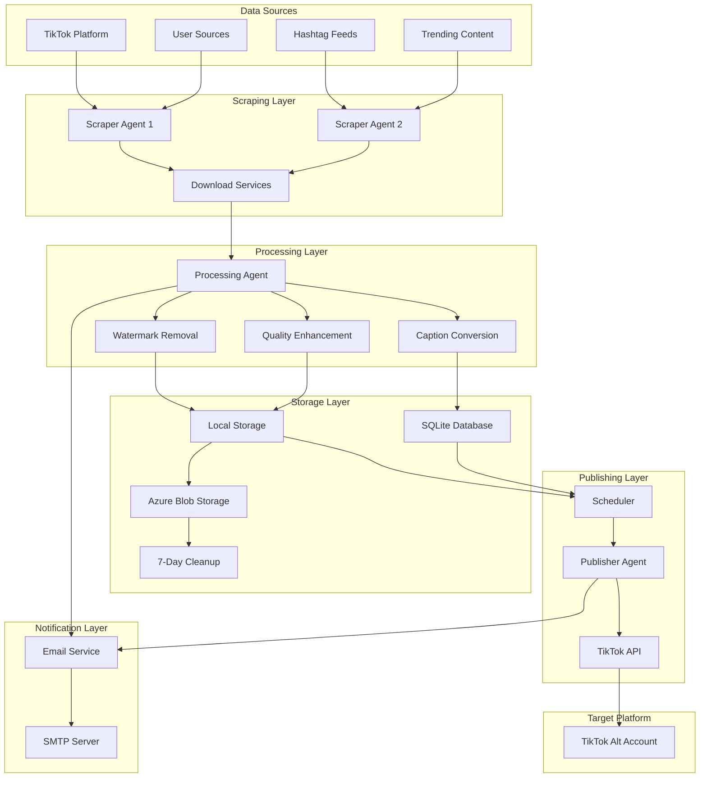

# 🔄 Data Flow Documentation

This document outlines the complete data flow and system architecture for the TikTok Video Reposter Dashboard, from content discovery to TikTok reposting, designed for local operation with JavaScript-based services.

## 🎯 System Overview

The TikTok Reposter system follows an agentic automation approach where intelligent agents handle different aspects of the content workflow. The dashboard provides monitoring and control over these automated processes, with all operations running locally and TikTok as the primary target platform.



## 📊 Detailed Data Flow Stages

### 1. Content Discovery & Source Monitoring

**Trigger**: Scheduled intervals or user-initiated scans

#### 1.1 Source Configuration

```javascript
// Source configuration data structure
{
  "sourceId": "src_001",
  "type": "username|hashtag|trending",
  "value": "@techguru123",
  "frequency": "daily|hourly|custom",
  "cronExpression": "0 */6 * * *",
  "active": true,
  "filters": {
    "minViews": 10000,
    "maxAge": "7d",
    "videoQuality": "720p+"
  }
}
```

#### 1.2 Scraping Process

1. **Agent Assignment**: Load balancer assigns sources to available scraper agents
2. **Authentication**: Agents authenticate with TikTok (if required)
3. **Content Fetching**: Retrieve video metadata and URLs
4. **Filtering**: Apply user-defined filters (views, age, quality)
5. **Deduplication**: Check against existing videos in SQLite database

#### 1.3 Data Extraction

```javascript
// Scraped video metadata
{
  "videoId": "vid_123456",
  "originalUrl": "https://tiktok.com/@user/video/123",
  "title": "Amazing tech demo",
  "description": "Check out this cool tech...",
  "author": "@techguru123",
  "authorId": "user_789",
  "stats": {
    "views": 2100000,
    "likes": 156000,
    "comments": 8900,
    "shares": 45000
  },
  "hashtags": ["#tech", "#ai", "#demo"],
  "duration": 45,
  "quality": "1080p",
  "uploadDate": "2024-01-15T10:30:00Z",
  "scrapedAt": "2024-01-15T16:45:00Z"
}
```

### 2. Video Download & Processing

**Trigger**: New video discovered and approved for download

#### 2.1 Download Service Selection

```javascript
// Download service priority and failover
const downloadServices = [
  {
    name: "SSSTik",
    priority: 1,
    rateLimit: "100/hour",
    status: "active",
  },
  {
    name: "TikMate",
    priority: 2,
    rateLimit: "50/hour",
    status: "active",
  },
  {
    name: "SnapTik",
    priority: 3,
    rateLimit: "30/hour",
    status: "fallback",
  },
];
```

#### 2.2 Download Process Flow

1. **Service Selection**: Choose primary download service
2. **URL Processing**: Extract video download URLs
3. **Download Initiation**: Start video file download to local storage
4. **Progress Tracking**: Monitor download progress
5. **Validation**: Verify file integrity and quality
6. **Fallback Logic**: Try alternative services on failure

#### 2.3 Processing Pipeline

```javascript
// Processing workflow
const processingSteps = [
  {
    step: "watermark_removal",
    enabled: true,
    method: "ai_detection",
  },
  {
    step: "quality_enhancement",
    enabled: false,
    settings: {
      upscale: false,
      stabilization: true,
      noise_reduction: false,
    },
  },
  {
    step: "format_conversion",
    enabled: true,
    outputFormat: "mp4",
    codec: "h264",
  },
  {
    step: "thumbnail_generation",
    enabled: true,
    count: 3,
    timestamps: ["10%", "50%", "90%"],
  },
];
```

### 3. Content Storage & Management

**Purpose**: Secure local storage with Azure cloud backup

#### 3.1 Local Storage Structure

```
/TikTokReposter/
├── storage/
│   ├── videos/                 # Primary video storage
│   │   └── 2024/01/15/
│   ├── thumbnails/             # Generated thumbnails
│   │   └── 2024/01/15/
│   ├── temp/                   # Temporary processing files
│   └── database.sqlite         # SQLite database
├── config/
│   ├── database.js
│   ├── azure.js
│   └── email.js
└── logs/                       # System logs
```

#### 3.2 Database Schema

```sql
-- Videos table
CREATE TABLE videos (
    id INTEGER PRIMARY KEY,
    video_id VARCHAR(50) UNIQUE,
    source_id VARCHAR(50),
    original_url TEXT,
    local_path TEXT,
    azure_path TEXT,
    title TEXT,
    description TEXT,
    author VARCHAR(100),
    hashtags JSON,
    stats JSON,
    processing_status VARCHAR(20),
    created_at TIMESTAMP,
    updated_at TIMESTAMP
);

-- Sources table
CREATE TABLE sources (
    id INTEGER PRIMARY KEY,
    source_type VARCHAR(20),
    source_value VARCHAR(100),
    configuration JSON,
    status VARCHAR(20),
    last_scraped TIMESTAMP,
    created_at TIMESTAMP
);

-- Scheduled posts table
CREATE TABLE scheduled_posts (
    id INTEGER PRIMARY KEY,
    video_id VARCHAR(50),
    tiktok_account VARCHAR(100),
    scheduled_time TIMESTAMP,
    status VARCHAR(20),
    post_id VARCHAR(100),
    created_at TIMESTAMP
);
```

#### 3.3 Azure Blob Storage Integration

```javascript
// Azure storage configuration
{
  "provider": "azure-blob",
  "credentials": {
    "connectionString": "encrypted_connection_string",
    "containerName": "tiktok-videos",
    "storageAccount": "tiktokrepostervids"
  },
  "settings": {
    "autoUpload": true,
    "deleteLocalAfterUpload": false,
    "publicAccess": false,
    "lifecycle": {
      "deleteAfter": "7d",
      "enableLogging": true
    }
  }
}
```

#### 3.4 Automated Cleanup Service

```javascript
// 7-day cleanup service
const cleanupService = {
  "schedule": "0 2 * * *", // Daily at 2 AM
  "actions": [
    {
      "type": "azure_cleanup",
      "retention": "7d",
      "dryRun": false
    },
    {
      "type": "temp_file_cleanup",
      "retention": "24h",
      "path": "./storage/temp"
    }
  ]
};
```

### 4. Caption & Metadata Processing

**Purpose**: Generate appropriate captions for TikTok reposting

#### 4.1 Caption Generation Methods

```javascript
// Caption configuration
{
  "method": "original|template|ai_generated",
  "templateConfig": {
    "template": "🔥 Amazing content from @{original_author}!\n\n#viral #trending #repost {original_hashtags}",
    "variables": {
      "original_author": "@techguru123",
      "original_hashtags": "#tech #ai #demo",
      "video_title": "Amazing tech demo",
      "platform": "tiktok"
    }
  },
  "aiConfig": {
    "provider": "openai|claude|custom",
    "prompt": "Generate an engaging TikTok caption for this video...",
    "maxLength": 150,
    "includeHashtags": true,
    "creditOriginal": true
  }
}
```

#### 4.2 TikTok-Specific Requirements

```javascript
// TikTok caption specifications
const tiktokSpecs = {
  maxLength: 150,
  hashtagLimit: null, // No strict limit
  supportsMarkdown: false,
  requiresDescription: false,
  optimalHashtags: "3-5",
  trendingHashtags: true
};
```

### 5. Scheduling & Queue Management

**Purpose**: Optimize TikTok posting times and manage rate limits

#### 5.1 Scheduling Algorithm

```javascript
// Scheduling configuration
{
  "strategy": "interval|specific_times|ai_optimal",
  "intervalConfig": {
    "frequency": "3_hours",
    "activeHours": {
      "start": "08:00",
      "end": "22:00"
    },
    "activeDays": [1, 2, 3, 4, 5, 6, 7], // All days
    "timezone": "America/New_York"
  },
  "specificConfig": {
    "times": ["09:00", "14:00", "19:00"],
    "timezone": "America/New_York"
  },
  "aiConfig": {
    "optimizeForEngagement": true,
    "considerTimeZones": true,
    "learningEnabled": true
  }
}
```

#### 5.2 Queue Management

```javascript
// Post queue structure
{
  "queueId": "queue_001",
  "videoId": "vid_123456",
  "platform": "tiktok",
  "tiktokAccount": "@myaltaccount",
  "scheduledTime": "2024-01-15T14:00:00Z",
  "priority": "normal|high|low",
  "status": "queued|processing|posted|failed",
  "attempts": 0,
  "maxAttempts": 3,
  "lastAttempt": null,
  "errorMessage": null,
  "metadata": {
    "caption": "Generated caption...",
    "hashtags": ["#viral", "#trending"],
    "accountCredentials": "encrypted_token"
  }
}
```

### 6. TikTok Publishing

**Purpose**: Distribute content to alternative TikTok accounts

#### 6.1 TikTok API Integration

```javascript
// TikTok API configuration
const tiktokAPI = {
  endpoint: "https://open-api.tiktok.com",
  auth: "oauth2",
  rateLimit: "100/day",
  mediaTypes: ["video"],
  maxVideoSize: "287MB",
  maxDuration: "180s",
  supportedFormats: ["mp4", "mov", "mpeg", "3gp", "avi"]
};
```

#### 6.2 Publishing Workflow

1. **Pre-Publishing Validation**
   - Check TikTok API rate limits
   - Validate video format and size
   - Verify authentication tokens
   - Confirm caption requirements

2. **Upload Process**
   - Initialize upload session with TikTok
   - Upload video file (chunked if necessary)
   - Set video metadata and caption
   - Schedule or publish immediately

3. **Post-Publishing Actions**
   - Store TikTok post ID
   - Update SQLite database with published status
   - Trigger email notification
   - Queue retry attempts if needed

#### 6.3 Error Handling & Retry Logic

```javascript
// Retry configuration
{
  "maxAttempts": 3,
  "retryDelay": "exponential", // 1min, 5min, 15min
  "retryConditions": [
    "rate_limit_exceeded",
    "temporary_server_error",
    "network_timeout",
    "invalid_token"
  ],
  "failureActions": {
    "emailNotify": true,
    "moveToManualReview": true,
    "pauseAccount": false
  }
}
```

### 7. Email Notification System

**Purpose**: Keep users informed of system status and activities

#### 7.1 SMTP Configuration

```javascript
// Email service configuration
{
  "smtp": {
    "host": "smtp.gmail.com",
    "port": 587,
    "secure": false,
    "auth": {
      "user": "your_email@gmail.com",
      "pass": "app_password"
    }
  },
  "templates": {
    "success": "./templates/success.html",
    "error": "./templates/error.html",
    "daily_summary": "./templates/daily_summary.html"
  },
  "recipients": {
    "errors": ["admin@yourdomain.com"],
    "summaries": ["reports@yourdomain.com"],
    "all": ["notifications@yourdomain.com"]
  }
}
```

#### 7.2 Notification Types

```javascript
// Email notification categories
const notificationTypes = {
  "system_start": {
    "template": "system_status",
    "recipients": "admin",
    "priority": "normal"
  },
  "video_posted": {
    "template": "success",
    "recipients": "all",
    "priority": "low"
  },
  "posting_error": {
    "template": "error",
    "recipients": "errors",
    "priority": "high"
  },
  "daily_summary": {
    "template": "daily_summary",
    "recipients": "summaries",
    "priority": "normal",
    "schedule": "0 18 * * *"
  }
};
```

### 8. Monitoring & Analytics

**Purpose**: Track system performance and content success metrics

#### 8.1 System Metrics

```javascript
// System performance metrics
{
  "timestamp": "2024-01-15T16:00:00Z",
  "metrics": {
    "scraping": {
      "videosFound": 23,
      "videosDownloaded": 20,
      "failures": 3,
      "avgProcessingTime": "45s"
    },
    "processing": {
      "queueSize": 12,
      "processingRate": "8/hour",
      "successRate": 0.95,
      "avgFileSize": "15MB"
    },
    "publishing": {
      "postsScheduled": 47,
      "postsPublished": 8,
      "apiErrors": 2,
      "rateLimitHits": 1
    },
    "storage": {
      "localUsage": "2.3GB",
      "azureUsage": "1.8GB",
      "cleanupRuns": 7
    }
  }
}
```

#### 8.2 Content Performance Tracking

```javascript
// Content analytics
{
  "videoId": "vid_123456",
  "tiktokPost": {
    "postId": "tiktok_post_789",
    "publishedAt": "2024-01-15T14:00:00Z",
    "metrics": {
      "views": 1500,
      "likes": 89,
      "comments": 12,
      "shares": 6,
      "lastUpdated": "2024-01-15T18:00:00Z"
    }
  }
}
```

## 🔧 Local Integration Points

### Express.js API Endpoints

```javascript
// Dashboard API endpoints
const dashboardAPI = {
  "GET /api/dashboard/stats": "System overview statistics",
  "GET /api/sources": "List configured sources",
  "POST /api/sources": "Add new source",
  "GET /api/videos": "List videos with filters",
  "PUT /api/videos/:id": "Update video metadata",
  "GET /api/logs": "Retrieve system logs",
  "POST /api/publish/:videoId": "Manually trigger publish",
  "GET /api/settings": "Get system configuration",
  "PUT /api/settings": "Update system configuration",
};
```

### WebSocket Events

```javascript
// WebSocket event types
const wsEvents = {
  "agent.status.changed": "Agent status updates",
  "video.processing.progress": "Processing progress",
  "post.published": "Successful post publication",
  "error.occurred": "System errors",
  "queue.updated": "Queue status changes",
  "storage.cleanup": "Azure cleanup notifications"
};
```

### Dashboard State Management

```javascript
// Dashboard state updates
{
  "type": "AGENT_STATUS_UPDATE",
  "payload": {
    "agentId": "scraper-1",
    "status": "active",
    "currentTask": "Scraping @techguru123",
    "progress": 0.65
  }
}
```

## 📈 Performance Considerations

### Scalability Points

1. **Concurrent Processing**: Multiple agents can work simultaneously
2. **Database Optimization**: Indexed SQLite queries for video searches
3. **File System Efficiency**: Organized directory structure for fast access
4. **Load Balancing**: Distribute scraping tasks across agents
5. **Queue Management**: Priority-based queue processing

### Rate Limit Management

```javascript
// Rate limiting strategy for TikTok
{
  "platform": "tiktok",
  "limits": {
    "postsPerHour": 5,
    "postsPerDay": 25,
    "apiCallsPerHour": 100
  },
  "current": {
    "postsThisHour": 2,
    "postsToday": 8,
    "apiCallsThisHour": 67
  },
  "strategy": "queue_delay|skip_until_reset|use_alternative_account"
}
```

### Azure Storage Optimization

```javascript
// Storage optimization settings
{
  "uploadStrategy": "background_async",
  "compressionLevel": "standard",
  "parallelUploads": 3,
  "retryPolicy": {
    "maxRetries": 3,
    "backoff": "exponential"
  },
  "cleanupMonitoring": {
    "logDeletions": true,
    "emailSummary": true
  }
}
```

## 🚨 Error Handling & Recovery

### Error Types and Recovery

1. **Network Errors**: Retry with exponential backoff
2. **TikTok API Errors**: Check rate limits, refresh tokens
3. **Processing Errors**: Move to manual review queue
4. **Storage Errors**: Fallback to local-only storage
5. **Azure Errors**: Continue with local storage, retry upload later

### Data Integrity

- SQLite transactions for critical operations
- File checksums for integrity verification
- Automated backup strategies for database
- Recovery procedures for partial failures
- Email alerts for critical system issues

### Local Environment Recovery

```javascript
// Recovery procedures
const recoveryActions = {
  "database_corruption": "restore_from_backup",
  "storage_full": "cleanup_old_files_and_notify",
  "azure_connection_lost": "queue_uploads_for_retry",
  "tiktok_auth_expired": "pause_posting_and_notify",
  "agent_crash": "restart_agent_and_log"
};
```

This data flow documentation provides a comprehensive view of how data moves through the TikTok Reposter system, focusing on local operation, TikTok-specific workflows, Azure storage integration, and email-based notifications.
