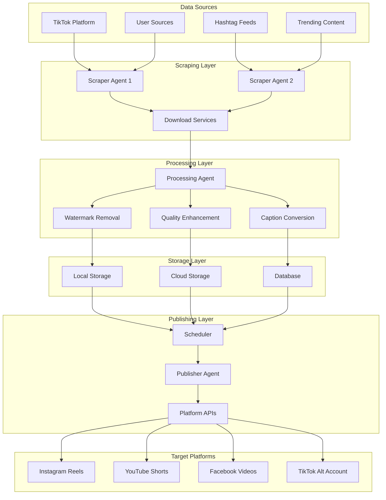

# 🔄 Data Flow Documentation

This document outlines the complete data flow and system architecture for the TikTok Video Reposter Dashboard, from content discovery to multi-platform distribution.

## 🎯 System Overview

The TikTok Reposter system follows an agentic automation approach where intelligent agents handle different aspects of the content workflow. The dashboard provides monitoring and control over these automated processes.



## 📊 Detailed Data Flow Stages

### 1. Content Discovery & Source Monitoring

**Trigger**: Scheduled intervals or user-initiated scans

#### 1.1 Source Configuration

```javascript
// Source configuration data structure
{
  "sourceId": "src_001",
  "type": "username|hashtag|trending",
  "value": "@techguru123",
  "frequency": "daily|hourly|custom",
  "cronExpression": "0 */6 * * *",
  "active": true,
  "filters": {
    "minViews": 10000,
    "maxAge": "7d",
    "videoQuality": "720p+"
  }
}
```

#### 1.2 Scraping Process

1. **Agent Assignment**: Load balancer assigns sources to available scraper agents
2. **Authentication**: Agents authenticate with TikTok (if required)
3. **Content Fetching**: Retrieve video metadata and URLs
4. **Filtering**: Apply user-defined filters (views, age, quality)
5. **Deduplication**: Check against existing videos in database

#### 1.3 Data Extraction

```javascript
// Scraped video metadata
{
  "videoId": "vid_123456",
  "originalUrl": "https://tiktok.com/@user/video/123",
  "title": "Amazing tech demo",
  "description": "Check out this cool tech...",
  "author": "@techguru123",
  "authorId": "user_789",
  "stats": {
    "views": 2100000,
    "likes": 156000,
    "comments": 8900,
    "shares": 45000
  },
  "hashtags": ["#tech", "#ai", "#demo"],
  "duration": 45,
  "quality": "1080p",
  "uploadDate": "2024-01-15T10:30:00Z",
  "scrapedAt": "2024-01-15T16:45:00Z"
}
```

### 2. Video Download & Processing

**Trigger**: New video discovered and approved for download

#### 2.1 Download Service Selection

```javascript
// Download service priority and failover
const downloadServices = [
  {
    name: "SSSTik",
    priority: 1,
    rateLimit: "100/hour",
    status: "active",
  },
  {
    name: "TikMate",
    priority: 2,
    rateLimit: "50/hour",
    status: "active",
  },
  {
    name: "SnapTik",
    priority: 3,
    rateLimit: "30/hour",
    status: "fallback",
  },
];
```

#### 2.2 Download Process Flow

1. **Service Selection**: Choose primary download service
2. **URL Processing**: Extract video download URLs
3. **Download Initiation**: Start video file download
4. **Progress Tracking**: Monitor download progress
5. **Validation**: Verify file integrity and quality
6. **Fallback Logic**: Try alternative services on failure

#### 2.3 Processing Pipeline

```javascript
// Processing workflow
const processingSteps = [
  {
    step: "watermark_removal",
    enabled: true,
    method: "ai_detection",
  },
  {
    step: "quality_enhancement",
    enabled: false,
    settings: {
      upscale: false,
      stabilization: true,
      noise_reduction: false,
    },
  },
  {
    step: "format_conversion",
    enabled: true,
    outputFormat: "mp4",
    codec: "h264",
  },
  {
    step: "thumbnail_generation",
    enabled: true,
    count: 3,
    timestamps: ["10%", "50%", "90%"],
  },
];
```

### 3. Content Storage & Management

**Purpose**: Secure storage and organization of processed videos

#### 3.1 Local Storage Structure

```
/TikTokReposter/
├── videos/
│   ├── raw/                    # Original downloads
│   │   └── 2024/01/15/
│   ├── processed/              # Processed videos
│   │   └── 2024/01/15/
│   └── thumbnails/             # Generated thumbnails
│       └── 2024/01/15/
├── data/
│   ├── database.sqlite         # Metadata database
│   ├── logs/                   # System logs
│   └── config/                 # Configuration files
└── temp/                       # Temporary processing files
```

#### 3.2 Database Schema

```sql
-- Videos table
CREATE TABLE videos (
    id INTEGER PRIMARY KEY,
    video_id VARCHAR(50) UNIQUE,
    source_id VARCHAR(50),
    original_url TEXT,
    local_path TEXT,
    cloud_path TEXT,
    title TEXT,
    description TEXT,
    author VARCHAR(100),
    hashtags JSON,
    stats JSON,
    processing_status VARCHAR(20),
    created_at TIMESTAMP,
    updated_at TIMESTAMP
);

-- Sources table
CREATE TABLE sources (
    id INTEGER PRIMARY KEY,
    source_type VARCHAR(20),
    source_value VARCHAR(100),
    configuration JSON,
    status VARCHAR(20),
    last_scraped TIMESTAMP,
    created_at TIMESTAMP
);

-- Scheduled posts table
CREATE TABLE scheduled_posts (
    id INTEGER PRIMARY KEY,
    video_id VARCHAR(50),
    platform VARCHAR(50),
    scheduled_time TIMESTAMP,
    status VARCHAR(20),
    post_id VARCHAR(100),
    created_at TIMESTAMP
);
```

#### 3.3 Cloud Storage Integration

```javascript
// Cloud storage configuration
{
  "provider": "aws-s3|google-cloud|azure|dropbox",
  "credentials": {
    "accessKey": "encrypted_key",
    "secretKey": "encrypted_secret",
    "bucket": "tiktok-reposter-videos",
    "region": "us-west-2"
  },
  "settings": {
    "autoUpload": true,
    "deleteLocalAfterUpload": false,
    "publicAccess": false,
    "lifecycle": {
      "deleteAfter": "90d",
      "archiveAfter": "30d"
    }
  }
}
```

### 4. Caption & Metadata Processing

**Purpose**: Generate appropriate captions for each target platform

#### 4.1 Caption Generation Methods

```javascript
// Caption configuration
{
  "method": "original|template|ai_generated",
  "templateConfig": {
    "template": "🔥 Amazing content from @{original_author}!\n\n#viral #trending #repost {original_hashtags}",
    "variables": {
      "original_author": "@techguru123",
      "original_hashtags": "#tech #ai #demo",
      "video_title": "Amazing tech demo",
      "platform": "instagram"
    }
  },
  "aiConfig": {
    "provider": "openai|claude|custom",
    "prompt": "Generate an engaging caption for this video...",
    "maxLength": 150,
    "includeHashtags": true,
    "creditOriginal": true
  }
}
```

#### 4.2 Platform-Specific Adaptations

```javascript
// Platform caption requirements
const platformSpecs = {
  instagram: {
    maxLength: 2200,
    hashtagLimit: 30,
    supportsMarkdown: false,
    requiresDescription: false,
  },
  youtube: {
    maxLength: 5000,
    hashtagLimit: 15,
    supportsMarkdown: true,
    requiresDescription: true,
  },
  facebook: {
    maxLength: 63206,
    hashtagLimit: null,
    supportsMarkdown: false,
    requiresDescription: false,
  },
  tiktok: {
    maxLength: 150,
    hashtagLimit: null,
    supportsMarkdown: false,
    requiresDescription: false,
  },
};
```

### 5. Scheduling & Queue Management

**Purpose**: Optimize posting times and manage platform rate limits

#### 5.1 Scheduling Algorithm

```javascript
// Scheduling configuration
{
  "strategy": "interval|specific_times|ai_optimal",
  "intervalConfig": {
    "frequency": "3_hours",
    "activeHours": {
      "start": "08:00",
      "end": "22:00"
    },
    "activeDays": [1, 2, 3, 4, 5], // Monday-Friday
    "timezone": "America/New_York"
  },
  "specificConfig": {
    "times": ["09:00", "14:00", "19:00"],
    "timezone": "America/New_York"
  },
  "aiConfig": {
    "optimizeForEngagement": true,
    "considerTimeZones": true,
    "learningEnabled": true
  }
}
```

#### 5.2 Queue Management

```javascript
// Post queue structure
{
  "queueId": "queue_001",
  "videoId": "vid_123456",
  "platform": "instagram",
  "scheduledTime": "2024-01-15T14:00:00Z",
  "priority": "normal|high|low",
  "status": "queued|processing|posted|failed",
  "attempts": 0,
  "maxAttempts": 3,
  "lastAttempt": null,
  "errorMessage": null,
  "metadata": {
    "caption": "Generated caption...",
    "hashtags": ["#viral", "#trending"],
    "accountId": "account_123"
  }
}
```

### 6. Multi-Platform Publishing

**Purpose**: Distribute content across configured social media platforms

#### 6.1 Platform API Integration

```javascript
// API configuration per platform
const apiConfigs = {
  instagram: {
    endpoint: "https://graph.facebook.com/v18.0",
    auth: "oauth2",
    rateLimit: "200/hour",
    mediaTypes: ["image", "video"],
    maxVideoSize: "100MB",
    maxDuration: "60s",
  },
  youtube: {
    endpoint: "https://www.googleapis.com/youtube/v3",
    auth: "oauth2",
    rateLimit: "10000/day",
    mediaTypes: ["video"],
    maxVideoSize: "256GB",
    maxDuration: "60s", // For Shorts
  },
  facebook: {
    endpoint: "https://graph.facebook.com/v18.0",
    auth: "oauth2",
    rateLimit: "200/hour",
    mediaTypes: ["image", "video"],
    maxVideoSize: "10GB",
    maxDuration: "240m",
  },
};
```

#### 6.2 Publishing Workflow

1. **Pre-Publishing Validation**

   - Check API rate limits
   - Validate video format and size
   - Verify authentication tokens
   - Confirm caption requirements

2. **Upload Process**

   - Initialize upload session
   - Upload video file (chunked if necessary)
   - Set video metadata
   - Schedule or publish immediately

3. **Post-Publishing Actions**
   - Store platform-specific post ID
   - Update database with published status
   - Log success/failure details
   - Queue retry attempts if needed

#### 6.3 Error Handling & Retry Logic

```javascript
// Retry configuration
{
  "maxAttempts": 3,
  "retryDelay": "exponential", // 1min, 5min, 15min
  "retryConditions": [
    "rate_limit_exceeded",
    "temporary_server_error",
    "network_timeout"
  ],
  "failureActions": {
    "notify": true,
    "moveToManualReview": true,
    "disableSource": false
  }
}
```

### 7. Monitoring & Analytics

**Purpose**: Track system performance and content success metrics

#### 7.1 System Metrics

```javascript
// System performance metrics
{
  "timestamp": "2024-01-15T16:00:00Z",
  "metrics": {
    "scraping": {
      "videosFound": 23,
      "videosDownloaded": 20,
      "failures": 3,
      "avgProcessingTime": "45s"
    },
    "processing": {
      "queueSize": 12,
      "processingRate": "8/hour",
      "successRate": 0.95,
      "avgFileSize": "15MB"
    },
    "publishing": {
      "postsScheduled": 47,
      "postsPublished": 8,
      "apiErrors": 2,
      "rateLimitHits": 1
    }
  }
}
```

#### 7.2 Content Performance Tracking

```javascript
// Content analytics
{
  "videoId": "vid_123456",
  "platforms": [
    {
      "platform": "instagram",
      "postId": "ig_post_789",
      "publishedAt": "2024-01-15T14:00:00Z",
      "metrics": {
        "views": 1500,
        "likes": 89,
        "comments": 12,
        "shares": 6,
        "lastUpdated": "2024-01-15T18:00:00Z"
      }
    }
  ]
}
```

## 🔧 Integration Points

### n8n Workflow Integration

The dashboard interfaces with n8n workflows that handle the backend automation:

```javascript
// n8n webhook endpoints
const webhookEndpoints = {
  scraping: "/webhook/scraping-complete",
  processing: "/webhook/video-processed",
  publishing: "/webhook/post-published",
  errors: "/webhook/error-notification",
};
```

### API Endpoints for Dashboard

```javascript
// Dashboard API endpoints
const dashboardAPI = {
  "GET /api/dashboard/stats": "System overview statistics",
  "GET /api/sources": "List configured sources",
  "POST /api/sources": "Add new source",
  "GET /api/videos": "List videos with filters",
  "PUT /api/videos/:id": "Update video metadata",
  "GET /api/logs": "Retrieve system logs",
  "POST /api/publish/:videoId": "Manually trigger publish",
  "GET /api/settings": "Get system configuration",
  "PUT /api/settings": "Update system configuration",
};
```

## 🔄 Real-Time Updates

### WebSocket Events

```javascript
// WebSocket event types
const wsEvents = {
  "agent.status.changed": "Agent status updates",
  "video.processing.progress": "Processing progress",
  "post.published": "Successful post publication",
  "error.occurred": "System errors",
  "queue.updated": "Queue status changes",
};
```

### Dashboard State Management

```javascript
// Dashboard state updates
{
  "type": "AGENT_STATUS_UPDATE",
  "payload": {
    "agentId": "scraper-1",
    "status": "active",
    "currentTask": "Scraping @techguru123",
    "progress": 0.65
  }
}
```

## 📈 Performance Considerations

### Scalability Points

1. **Concurrent Processing**: Multiple agents can work simultaneously
2. **Database Optimization**: Indexed queries for video searches
3. **Cache Strategy**: Redis for frequently accessed data
4. **Load Balancing**: Distribute scraping tasks across agents
5. **Queue Management**: Priority-based queue processing

### Rate Limit Management

```javascript
// Rate limiting strategy
{
  "platform": "instagram",
  "limits": {
    "postsPerHour": 5,
    "postsPerDay": 25,
    "apiCallsPerHour": 200
  },
  "current": {
    "postsThisHour": 2,
    "postsToday": 8,
    "apiCallsThisHour": 67
  },
  "strategy": "queue_delay|skip_until_reset|use_alternative_account"
}
```

## 🚨 Error Handling & Recovery

### Error Types and Recovery

1. **Network Errors**: Retry with exponential backoff
2. **API Errors**: Check rate limits, refresh tokens
3. **Processing Errors**: Move to manual review queue
4. **Storage Errors**: Fallback to alternative storage
5. **Authentication Errors**: Notify admin, pause operations

### Data Integrity

- Database transactions for critical operations
- Checksums for file integrity verification
- Backup strategies for configuration and logs
- Recovery procedures for partial failures

This data flow documentation provides a comprehensive view of how data moves through the TikTok Reposter system, enabling stakeholders to understand the complete automation workflow and integration points.
