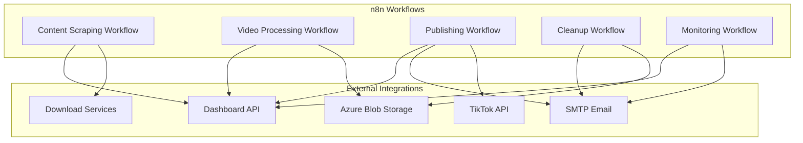

# 🔗 n8n Integration Documentation - TikTok Reposter

This document provides comprehensive n8n workflow integration specifications for the TikTok Video Reposter system, designed for local operation with TikTok-only reposting, Azure Blob Storage, and email notifications.

## 🎯 Integration Overview

The TikTok Reposter system uses n8n as the core automation engine, orchestrating the complete workflow from content discovery to TikTok publishing. All workflows run locally and integrate with the Express.js dashboard via webhooks and API calls.

### 🏗️ Architecture Components



## 📋 Workflow Specifications

### 1. Content Scraping Workflow

**Workflow Name**: `tiktok-content-scraper`  
**Trigger**: Cron Schedule + Manual Trigger  
**Purpose**: Discover and queue TikTok videos for download

#### 1.1 Workflow Nodes

```json
{
  "workflow": {
    "name": "tiktok-content-scraper",
    "nodes": [
      {
        "name": "Schedule Trigger",
        "type": "n8n-nodes-base.cron",
        "parameters": {
          "rule": {
            "interval": [
              {
                "field": "minute",
                "value": 0
              },
              {
                "field": "hour",
                "value": "*/2"
              }
            ]
          }
        }
      },
      {
        "name": "Get Active Sources",
        "type": "n8n-nodes-base.httpRequest",
        "parameters": {
          "url": "http://localhost:3000/api/sources?status=active",
          "method": "GET",
          "responseFormat": "json"
        }
      },
      {
        "name": "Process Each Source",
        "type": "n8n-nodes-base.splitInBatches",
        "parameters": {
          "batchSize": 1
        }
      },
      {
        "name": "TikTok Scraper",
        "type": "n8n-nodes-base.code",
        "parameters": {
          "mode": "runOnceForAllItems",
          "jsCode": "// TikTok scraping logic here\nconst puppeteer = require('puppeteer');\nconst source = $input.all()[0].json;\n\nconst browser = await puppeteer.launch({ headless: true });\nconst page = await browser.newPage();\n\ntry {\n  let videos = [];\n  \n  if (source.source_type === 'username') {\n    await page.goto(`https://tiktok.com/@${source.source_value}`);\n    // Extract video URLs and metadata\n    videos = await page.evaluate(() => {\n      // Scraping logic for user videos\n      return Array.from(document.querySelectorAll('[data-e2e=\"user-post-item\"]')).map(item => ({\n        url: item.querySelector('a').href,\n        title: item.querySelector('[data-e2e=\"user-post-item-desc\"]')?.textContent || '',\n        // Add more metadata extraction\n      }));\n    });\n  } else if (source.source_type === 'hashtag') {\n    await page.goto(`https://tiktok.com/tag/${source.source_value}`);\n    // Extract hashtag videos\n  } else if (source.source_type === 'trending') {\n    await page.goto('https://tiktok.com/trending');\n    // Extract trending videos\n  }\n  \n  await browser.close();\n  \n  return videos.map(video => ({\n    json: {\n      ...video,\n      source_id: source.source_id,\n      scraped_at: new Date().toISOString()\n    }\n  }));\n} catch (error) {\n  await browser.close();\n  throw error;\n}"
        }
      },
      {
        "name": "Filter New Videos",
        "type": "n8n-nodes-base.httpRequest",
        "parameters": {
          "url": "http://localhost:3000/api/videos/check-exists",
          "method": "POST",
          "bodyParametersUi": {
            "parameter": [
              {
                "name": "videos",
                "value": "={{$json}}"
              }
            ]
          },
          "responseFormat": "json"
        }
      },
      {
        "name": "Apply Filters",
        "type": "n8n-nodes-base.code",
        "parameters": {
          "mode": "runOnceForEachItem",
          "jsCode": "const video = $input.item(0).json;\nconst source = $('Get Active Sources').item(0).json;\n\n// Apply source filters\nconst filters = JSON.parse(source.configuration).filters;\n\nif (filters.minViews && video.stats.views < filters.minViews) {\n  return null; // Skip this video\n}\n\nif (filters.maxAge) {\n  const maxAgeMs = parseDuration(filters.maxAge);\n  const videoAge = Date.now() - new Date(video.uploadDate).getTime();\n  if (videoAge > maxAgeMs) {\n    return null; // Skip this video\n  }\n}\n\nreturn { json: video };\n\nfunction parseDuration(duration) {\n  const units = { d: 86400000, h: 3600000, m: 60000, s: 1000 };\n  const match = duration.match(/(\\d+)([dhms])/i);\n  return match ? parseInt(match[1]) * units[match[2].toLowerCase()] : 0;\n}"
        }
      },
      {
        "name": "Save to Database",
        "type": "n8n-nodes-base.httpRequest",
        "parameters": {
          "url": "http://localhost:3000/api/videos",
          "method": "POST",
          "bodyParametersUi": {
            "parameter": [
              {
                "name": "video_id",
                "value": "={{$json.videoId}}"
              },
              {
                "name": "source_id",
                "value": "={{$json.source_id}}"
              },
              {
                "name": "original_url",
                "value": "={{$json.url}}"
              },
              {
                "name": "title",
                "value": "={{$json.title}}"
              },
              {
                "name": "description",
                "value": "={{$json.description}}"
              },
              {
                "name": "author",
                "value": "={{$json.author}}"
              },
              {
                "name": "hashtags",
                "value": "={{JSON.stringify($json.hashtags)}}"
              },
              {
                "name": "stats",
                "value": "={{JSON.stringify($json.stats)}}"
              },
              {
                "name": "processing_status",
                "value": "pending"
              }
            ]
          }
        }
      },
      {
        "name": "Trigger Download Workflow",
        "type": "n8n-nodes-base.httpRequest",
        "parameters": {
          "url": "http://localhost:5678/webhook/trigger-download",
          "method": "POST",
          "bodyParametersUi": {
            "parameter": [
              {
                "name": "video_id",
                "value": "={{$json.video_id}}"
              }
            ]
          }
        }
      },
      {
        "name": "Update Dashboard",
        "type": "n8n-nodes-base.httpRequest",
        "parameters": {
          "url": "http://localhost:3000/api/dashboard/webhook/scraping-complete",
          "method": "POST",
          "bodyParametersUi": {
            "parameter": [
              {
                "name": "source_id",
                "value": "={{$('Get Active Sources').item(0).json.source_id}}"
              },
              {
                "name": "videos_found",
                "value": "={{$runIndex}}"
              },
              {
                "name": "timestamp",
                "value": "={{new Date().toISOString()}}"
              }
            ]
          }
        }
      }
    ]
  }
}
```

### 2. Video Processing Workflow

**Workflow Name**: `tiktok-video-processor`  
**Trigger**: Webhook from Scraping Workflow  
**Purpose**: Download, process, and store videos

#### 2.1 Workflow Nodes

```json
{
  "workflow": {
    "name": "tiktok-video-processor",
    "nodes": [
      {
        "name": "Webhook Trigger",
        "type": "n8n-nodes-base.webhook",
        "parameters": {
          "path": "trigger-download",
          "httpMethod": "POST"
        }
      },
      {
        "name": "Get Video Details",
        "type": "n8n-nodes-base.httpRequest",
        "parameters": {
          "url": "http://localhost:3000/api/videos/{{$json.video_id}}",
          "method": "GET",
          "responseFormat": "json"
        }
      },
      {
        "name": "Download Service Selector",
        "type": "n8n-nodes-base.switch",
        "parameters": {
          "conditions": {
            "options": [
              {
                "conditions": [
                  {
                    "leftValue": "={{$json.download_service}}",
                    "rightValue": "ssstik",
                    "operator": {
                      "type": "string",
                      "operation": "equals"
                    }
                  }
                ],
                "output": 0
              },
              {
                "conditions": [
                  {
                    "leftValue": "={{$json.download_service}}",
                    "rightValue": "tikmate",
                    "operator": {
                      "type": "string",
                      "operation": "equals"
                    }
                  }
                ],
                "output": 1
              }
            ]
          },
          "fallbackOutput": 2
        }
      },
      {
        "name": "SSSTik Download",
        "type": "n8n-nodes-base.httpRequest",
        "parameters": {
          "url": "https://ssstik.io/abc",
          "method": "POST",
          "bodyParametersUi": {
            "parameter": [
              {
                "name": "id",
                "value": "={{$('Get Video Details').item(0).json.original_url}}"
              },
              {
                "name": "locale",
                "value": "en"
              },
              {
                "name": "tt",
                "value": "{{$('Get Video Details').item(0).json.video_id}}"
              }
            ]
          },
          "responseFormat": "json"
        }
      },
      {
        "name": "TikMate Download",
        "type": "n8n-nodes-base.httpRequest",
        "parameters": {
          "url": "https://tikmate.online/download",
          "method": "POST",
          "bodyParametersUi": {
            "parameter": [
              {
                "name": "url",
                "value": "={{$('Get Video Details').item(0).json.original_url}}"
              }
            ]
          },
          "responseFormat": "json"
        }
      },
      {
        "name": "SnapTik Fallback",
        "type": "n8n-nodes-base.httpRequest",
        "parameters": {
          "url": "https://snaptik.app/abc",
          "method": "POST",
          "bodyParametersUi": {
            "parameter": [
              {
                "name": "url",
                "value": "={{$('Get Video Details').item(0).json.original_url}}"
              }
            ]
          },
          "responseFormat": "json"
        }
      },
      {
        "name": "Download Video File",
        "type": "n8n-nodes-base.httpRequest",
        "parameters": {
          "url": "={{$json.download_url}}",
          "method": "GET",
          "responseFormat": "file",
          "outputFormat": "file"
        }
      },
      {
        "name": "Save to Local Storage",
        "type": "n8n-nodes-base.code",
        "parameters": {
          "mode": "runOnceForEachItem",
          "jsCode": "const fs = require('fs');\nconst path = require('path');\nconst crypto = require('crypto');\n\nconst video = $('Get Video Details').item(0).json;\nconst fileData = $input.item(0).binary.data;\n\n// Create directory structure\nconst date = new Date();\nconst year = date.getFullYear();\nconst month = String(date.getMonth() + 1).padStart(2, '0');\nconst day = String(date.getDate()).padStart(2, '0');\n\nconst videoDir = `./storage/videos/${year}/${month}/${day}`;\nif (!fs.existsSync(videoDir)) {\n  fs.mkdirSync(videoDir, { recursive: true });\n}\n\n// Generate filename\nconst fileExtension = '.mp4';\nconst fileName = `${video.video_id}${fileExtension}`;\nconst filePath = path.join(videoDir, fileName);\n\n// Save file\nfs.writeFileSync(filePath, fileData);\n\n// Calculate file size and checksum\nconst stats = fs.statSync(filePath);\nconst fileSize = stats.size;\nconst checksum = crypto.createHash('md5').update(fileData).digest('hex');\n\nreturn {\n  json: {\n    video_id: video.video_id,\n    local_path: filePath,\n    file_size: fileSize,\n    checksum: checksum,\n    download_completed_at: new Date().toISOString()\n  }\n};"
        }
      },
      {
        "name": "Process Video",
        "type": "n8n-nodes-base.code",
        "parameters": {
          "mode": "runOnceForEachItem",
          "jsCode": "const ffmpeg = require('fluent-ffmpeg');\nconst path = require('path');\nconst fs = require('fs');\n\nconst videoData = $input.item(0).json;\nconst inputPath = videoData.local_path;\nconst video = $('Get Video Details').item(0).json;\n\n// Processing configuration\nconst processingConfig = {\n  watermarkRemoval: process.env.ENABLE_WATERMARK_REMOVAL === 'true',\n  qualityEnhancement: process.env.ENABLE_QUALITY_ENHANCEMENT === 'true',\n  thumbnailGeneration: process.env.ENABLE_THUMBNAIL_GENERATION === 'true',\n  outputFormat: process.env.VIDEO_OUTPUT_FORMAT || 'mp4',\n  outputQuality: process.env.VIDEO_OUTPUT_QUALITY || '720p'\n};\n\nconst processedDir = inputPath.replace('/videos/', '/processed/');\nconst processedPath = processedDir.replace('.mp4', '_processed.mp4');\n\n// Ensure processed directory exists\nif (!fs.existsSync(path.dirname(processedPath))) {\n  fs.mkdirSync(path.dirname(processedPath), { recursive: true });\n}\n\nreturn new Promise((resolve, reject) => {\n  let command = ffmpeg(inputPath);\n  \n  // Apply processing options\n  if (processingConfig.watermarkRemoval) {\n    // Add watermark removal filter\n    command = command.videoFilters('delogo=x=10:y=10:w=100:h=50');\n  }\n  \n  if (processingConfig.outputQuality === '720p') {\n    command = command.size('1280x720');\n  }\n  \n  command\n    .output(processedPath)\n    .on('end', () => {\n      const stats = fs.statSync(processedPath);\n      resolve({\n        json: {\n          ...videoData,\n          processed_path: processedPath,\n          processed_size: stats.size,\n          processing_completed_at: new Date().toISOString()\n        }\n      });\n    })\n    .on('error', (err) => {\n      reject(err);\n    })\n    .run();\n});"
        }
      },
      {
        "name": "Generate Thumbnails",
        "type": "n8n-nodes-base.code",
        "parameters": {
          "mode": "runOnceForEachItem",
          "jsCode": "const ffmpeg = require('fluent-ffmpeg');\nconst path = require('path');\nconst fs = require('fs');\n\nconst videoData = $input.item(0).json;\nconst inputPath = videoData.processed_path || videoData.local_path;\n\n// Create thumbnails directory\nconst date = new Date();\nconst year = date.getFullYear();\nconst month = String(date.getMonth() + 1).padStart(2, '0');\nconst day = String(date.getDate()).padStart(2, '0');\n\nconst thumbnailDir = `./storage/thumbnails/${year}/${month}/${day}`;\nif (!fs.existsSync(thumbnailDir)) {\n  fs.mkdirSync(thumbnailDir, { recursive: true });\n}\n\nconst thumbnails = [];\nconst timestamps = ['10%', '50%', '90%'];\n\nreturn new Promise((resolve, reject) => {\n  let completed = 0;\n  \n  timestamps.forEach((timestamp, index) => {\n    const thumbnailPath = path.join(thumbnailDir, `${videoData.video_id}_${index + 1}.jpg`);\n    \n    ffmpeg(inputPath)\n      .seekInput(timestamp)\n      .frames(1)\n      .output(thumbnailPath)\n      .on('end', () => {\n        thumbnails.push(thumbnailPath);\n        completed++;\n        \n        if (completed === timestamps.length) {\n          resolve({\n            json: {\n              ...videoData,\n              thumbnails: thumbnails,\n              thumbnails_generated_at: new Date().toISOString()\n            }\n          });\n        }\n      })\n      .on('error', (err) => {\n        reject(err);\n      })\n      .run();\n  });\n});"
        }
      },
      {
        "name": "Upload to Azure",
        "type": "n8n-nodes-base.httpRequest",
        "parameters": {
          "url": "http://localhost:3000/api/azure/upload",
          "method": "POST",
          "bodyParametersUi": {
            "parameter": [
              {
                "name": "video_id",
                "value": "={{$json.video_id}}"
              },
              {
                "name": "local_path",
                "value": "={{$json.processed_path || $json.local_path}}"
              },
              {
                "name": "blob_name",
                "value": "videos/{{$json.video_id}}.mp4"
              }
            ]
          }
        }
      },
      {
        "name": "Update Database",
        "type": "n8n-nodes-base.httpRequest",
        "parameters": {
          "url": "http://localhost:3000/api/videos/{{$json.video_id}}",
          "method": "PUT",
          "bodyParametersUi": {
            "parameter": [
              {
                "name": "local_path",
                "value": "={{$json.processed_path || $json.local_path}}"
              },
              {
                "name": "azure_path",
                "value": "={{$('Upload to Azure').item(0).json.azure_url}}"
              },
              {
                "name": "file_size",
                "value": "={{$json.processed_size || $json.file_size}}"
              },
              {
                "name": "processing_status",
                "value": "processed"
              },
              {
                "name": "thumbnails",
                "value": "={{JSON.stringify($json.thumbnails)}}"
              }
            ]
          }
        }
      },
      {
        "name": "Notify Dashboard",
        "type": "n8n-nodes-base.httpRequest",
        "parameters": {
          "url": "http://localhost:3000/api/dashboard/webhook/video-processed",
          "method": "POST",
          "bodyParametersUi": {
            "parameter": [
              {
                "name": "video_id",
                "value": "={{$json.video_id}}"
              },
              {
                "name": "status",
                "value": "processed"
              },
              {
                "name": "timestamp",
                "value": "={{new Date().toISOString()}}"
              }
            ]
          }
        }
      }
    ]
  }
}
```

### 3. Publishing Workflow

**Workflow Name**: `tiktok-publisher`  
**Trigger**: Cron Schedule + Manual Trigger  
**Purpose**: Schedule and publish videos to TikTok accounts

#### 3.1 Workflow Nodes

```json
{
  "workflow": {
    "name": "tiktok-publisher",
    "nodes": [
      {
        "name": "Schedule Trigger",
        "type": "n8n-nodes-base.cron",
        "parameters": {
          "rule": {
            "interval": [
              {
                "field": "minute",
                "value": 0
              },
              {
                "field": "hour",
                "value": "*"
              }
            ]
          }
        }
      },
      {
        "name": "Get Scheduled Posts",
        "type": "n8n-nodes-base.httpRequest",
        "parameters": {
          "url": "http://localhost:3000/api/scheduled-posts?status=queued&due=true",
          "method": "GET",
          "responseFormat": "json"
        }
      },
      {
        "name": "Process Each Post",
        "type": "n8n-nodes-base.splitInBatches",
        "parameters": {
          "batchSize": 1
        }
      },
      {
        "name": "Get Video Details",
        "type": "n8n-nodes-base.httpRequest",
        "parameters": {
          "url": "http://localhost:3000/api/videos/{{$json.video_id}}",
          "method": "GET",
          "responseFormat": "json"
        }
      },
      {
        "name": "Generate Caption",
        "type": "n8n-nodes-base.code",
        "parameters": {
          "mode": "runOnceForEachItem",
          "jsCode": "const video = $('Get Video Details').item(0).json;\nconst scheduledPost = $input.item(0).json;\n\n// Get caption configuration\nconst captionMethod = process.env.CAPTION_METHOD || 'template';\n\nlet caption = '';\n\nif (captionMethod === 'original') {\n  caption = video.description;\n} else if (captionMethod === 'template') {\n  const template = process.env.CAPTION_TEMPLATE || '🔥 Amazing content from @{original_author}! #viral #trending';\n  \n  caption = template\n    .replace('{original_author}', video.author)\n    .replace('{original_hashtags}', JSON.parse(video.hashtags).join(' '))\n    .replace('{video_title}', video.title);\n} else if (captionMethod === 'ai_generated') {\n  // AI caption generation would go here\n  caption = `Check out this amazing content! ${JSON.parse(video.hashtags).slice(0, 5).join(' ')}`;\n}\n\n// Ensure caption meets TikTok requirements\nif (caption.length > 150) {\n  caption = caption.substring(0, 147) + '...';\n}\n\nreturn {\n  json: {\n    ...scheduledPost,\n    video: video,\n    generated_caption: caption\n  }\n};"
        }
      },
      {
        "name": "TikTok OAuth",
        "type": "n8n-nodes-base.httpRequest",
        "parameters": {
          "url": "https://open-api.tiktok.com/oauth/access_token/",
          "method": "POST",
          "bodyParametersUi": {
            "parameter": [
              {
                "name": "client_key",
                "value": "={{process.env.TIKTOK_CLIENT_ID}}"
              },
              {
                "name": "client_secret",
                "value": "={{process.env.TIKTOK_CLIENT_SECRET}}"
              },
              {
                "name": "code",
                "value": "={{$json.tiktok_account_token}}"
              },
              {
                "name": "grant_type",
                "value": "authorization_code"
              }
            ]
          },
          "responseFormat": "json"
        }
      },
      {
        "name": "Check Rate Limits",
        "type": "n8n-nodes-base.httpRequest",
        "parameters": {
          "url": "http://localhost:3000/api/rate-limits/tiktok",
          "method": "GET",
          "responseFormat": "json"
        }
      },
      {
        "name": "Rate Limit Check",
        "type": "n8n-nodes-base.if",
        "parameters": {
          "conditions": {
            "options": [
              {
                "conditions": [
                  {
                    "leftValue": "={{$json.can_post}}",
                    "rightValue": true,
                    "operator": {
                      "type": "boolean"
                    }
                  }
                ]
              }
            ]
          }
        }
      },
      {
        "name": "Upload Video to TikTok",
        "type": "n8n-nodes-base.httpRequest",
        "parameters": {
          "url": "https://open-api.tiktok.com/share/video/upload/",
          "method": "POST",
          "sendBinaryData": true,
          "binaryPropertyName": "video",
          "headers": {
            "Authorization": "Bearer {{$('TikTok OAuth').item(0).json.access_token}}",
            "Content-Type": "multipart/form-data"
          },
          "bodyParametersUi": {
            "parameter": [
              {
                "name": "video",
                "value": "={{$('Generate Caption').item(0).json.video.local_path}}"
              }
            ]
          },
          "responseFormat": "json"
        }
      },
      {
        "name": "Publish Video",
        "type": "n8n-nodes-base.httpRequest",
        "parameters": {
          "url": "https://open-api.tiktok.com/share/video/publish/",
          "method": "POST",
          "headers": {
            "Authorization": "Bearer {{$('TikTok OAuth').item(0).json.access_token}}",
            "Content-Type": "application/json"
          },
          "bodyParametersUi": {
            "parameter": [
              {
                "name": "media_id",
                "value": "={{$('Upload Video to TikTok').item(0).json.media_id}}"
              },
              {
                "name": "text",
                "value": "={{$('Generate Caption').item(0).json.generated_caption}}"
              },
              {
                "name": "privacy_level",
                "value": "SELF_ONLY"
              },
              {
                "name": "disable_duet",
                "value": false
              },
              {
                "name": "disable_comment",
                "value": false
              },
              {
                "name": "disable_stitch",
                "value": false
              }
            ]
          },
          "responseFormat": "json"
        }
      },
      {
        "name": "Update Post Status",
        "type": "n8n-nodes-base.httpRequest",
        "parameters": {
          "url": "http://localhost:3000/api/scheduled-posts/{{$('Generate Caption').item(0).json.id}}",
          "method": "PUT",
          "bodyParametersUi": {
            "parameter": [
              {
                "name": "status",
                "value": "posted"
              },
              {
                "name": "post_id",
                "value": "={{$json.share_id}}"
              },
              {
                "name": "posted_at",
                "value": "={{new Date().toISOString()}}"
              }
            ]
          }
        }
      },
      {
        "name": "Send Success Email",
        "type": "n8n-nodes-base.httpRequest",
        "parameters": {
          "url": "http://localhost:3000/api/email/success",
          "method": "POST",
          "bodyParametersUi": {
            "parameter": [
              {
                "name": "video_id",
                "value": "={{$('Generate Caption').item(0).json.video.video_id}}"
              },
              {
                "name": "video_title",
                "value": "={{$('Generate Caption').item(0).json.video.title}}"
              },
              {
                "name": "author",
                "value": "={{$('Generate Caption').item(0).json.video.author}}"
              },
              {
                "name": "tiktok_account",
                "value": "={{$('Generate Caption').item(0).json.tiktok_account}}"
              },
              {
                "name": "post_id",
                "value": "={{$('Publish Video').item(0).json.share_id}}"
              },
              {
                "name": "posted_at",
                "value": "={{new Date().toISOString()}}"
              }
            ]
          }
        }
      },
      {
        "name": "Notify Dashboard",
        "type": "n8n-nodes-base.httpRequest",
        "parameters": {
          "url": "http://localhost:3000/api/dashboard/webhook/post-published",
          "method": "POST",
          "bodyParametersUi": {
            "parameter": [
              {
                "name": "video_id",
                "value": "={{$('Generate Caption').item(0).json.video.video_id}}"
              },
              {
                "name": "post_id",
                "value": "={{$('Publish Video').item(0).json.share_id}}"
              },
              {
                "name": "tiktok_account",
                "value": "={{$('Generate Caption').item(0).json.tiktok_account}}"
              },
              {
                "name": "timestamp",
                "value": "={{new Date().toISOString()}}"
              }
            ]
          }
        }
      },
      {
        "name": "Rate Limit Delay",
        "type": "n8n-nodes-base.wait",
        "parameters": {
          "amount": 3600,
          "unit": "seconds"
        }
      },
      {
        "name": "Reschedule Post",
        "type": "n8n-nodes-base.httpRequest",
        "parameters": {
          "url": "http://localhost:3000/api/scheduled-posts/{{$('Generate Caption').item(0).json.id}}",
          "method": "PUT",
          "bodyParametersUi": {
            "parameter": [
              {
                "name": "scheduled_time",
                "value": "={{new Date(Date.now() + 3600000).toISOString()}}"
              },
              {
                "name": "status",
                "value": "queued"
              }
            ]
          }
        }
      }
    ]
  }
}
```

### 4. Azure Cleanup Workflow

**Workflow Name**: `azure-cleanup-service`  
**Trigger**: Daily Cron Schedule  
**Purpose**: Clean up expired videos from Azure Blob Storage

#### 4.1 Workflow Nodes

```json
{
  "workflow": {
    "name": "azure-cleanup-service",
    "nodes": [
      {
        "name": "Daily Cleanup Trigger",
        "type": "n8n-nodes-base.cron",
        "parameters": {
          "rule": {
            "interval": [
              {
                "field": "minute",
                "value": 0
              },
              {
                "field": "hour",
                "value": 2
              }
            ]
          }
        }
      },
      {
        "name": "Get Expired Videos",
        "type": "n8n-nodes-base.httpRequest",
        "parameters": {
          "url": "http://localhost:3000/api/azure/expired-videos",
          "method": "GET",
          "responseFormat": "json"
        }
      },
      {
        "name": "Process Each Video",
        "type": "n8n-nodes-base.splitInBatches",
        "parameters": {
          "batchSize": 10
        }
      },
      {
        "name": "Delete from Azure",
        "type": "n8n-nodes-base.httpRequest",
        "parameters": {
          "url": "http://localhost:3000/api/azure/delete",
          "method": "DELETE",
          "bodyParametersUi": {
            "parameter": [
              {
                "name": "blob_name",
                "value": "={{$json.name}}"
              }
            ]
          }
        }
      },
      {
        "name": "Log Cleanup Results",
        "type": "n8n-nodes-base.code",
        "parameters": {
          "mode": "runOnceForAllItems",
          "jsCode": "const deletedVideos = $input.all();\nconst totalDeleted = deletedVideos.length;\nconst totalSize = deletedVideos.reduce((sum, video) => sum + (video.json.size || 0), 0);\n\nreturn [{\n  json: {\n    cleanup_date: new Date().toISOString(),\n    videos_deleted: totalDeleted,\n    space_freed_mb: Math.round(totalSize / (1024 * 1024) * 100) / 100,\n    details: deletedVideos.map(v => ({\n      name: v.json.name,\n      size: v.json.size,\n      upload_date: v.json.upload_date\n    }))\n  }\n}];"
        }
      },
      {
        "name": "Send Cleanup Summary",
        "type": "n8n-nodes-base.httpRequest",
        "parameters": {
          "url": "http://localhost:3000/api/email/cleanup-summary",
          "method": "POST",
          "bodyParametersUi": {
            "parameter": [
              {
                "name": "cleanup_date",
                "value": "={{$json.cleanup_date}}"
              },
              {
                "name": "videos_deleted",
                "value": "={{$json.videos_deleted}}"
              },
              {
                "name": "space_freed_mb",
                "value": "={{$json.space_freed_mb}}"
              },
              {
                "name": "details",
                "value": "={{JSON.stringify($json.details)}}"
              }
            ]
          }
        }
      },
      {
        "name": "Update Dashboard Stats",
        "type": "n8n-nodes-base.httpRequest",
        "parameters": {
          "url": "http://localhost:3000/api/dashboard/webhook/cleanup-completed",
          "method": "POST",
          "bodyParametersUi": {
            "parameter": [
              {
                "name": "videos_deleted",
                "value": "={{$('Log Cleanup Results').item(0).json.videos_deleted}}"
              },
              {
                "name": "space_freed_mb",
                "value": "={{$('Log Cleanup Results').item(0).json.space_freed_mb}}"
              },
              {
                "name": "timestamp",
                "value": "={{new Date().toISOString()}}"
              }
            ]
          }
        }
      }
    ]
  }
}
```

### 5. Monitoring & Health Check Workflow

**Workflow Name**: `system-health-monitor`  
**Trigger**: 15-minute intervals  
**Purpose**: Monitor system health and send alerts

#### 5.1 Workflow Nodes

```json
{
  "workflow": {
    "name": "system-health-monitor",
    "nodes": [
      {
        "name": "Health Check Trigger",
        "type": "n8n-nodes-base.cron",
        "parameters": {
          "rule": {
            "interval": [
              {
                "field": "minute",
                "value": "*/15"
              }
            ]
          }
        }
      },
      {
        "name": "Check Dashboard API",
        "type": "n8n-nodes-base.httpRequest",
        "parameters": {
          "url": "http://localhost:3000/api/health",
          "method": "GET",
          "responseFormat": "json",
          "options": {
            "timeout": 5000
          }
        }
      },
      {
        "name": "Check Database",
        "type": "n8n-nodes-base.httpRequest",
        "parameters": {
          "url": "http://localhost:3000/api/health/database",
          "method": "GET",
          "responseFormat": "json"
        }
      },
      {
        "name" : "Check Azure Connection",
        "type": "n8n-nodes-base.httpRequest",
        "parameters": {
          "url": "http://localhost:3000/api/health/azure",
          "method": "GET",
          "responseFormat": "json"
        }
      },
      {
        "name": "Check Email Service",
        "type": "n8n-nodes-base.httpRequest",
        "parameters": {
          "url": "http://localhost:3000/api/health/email",
          "method": "GET",
          "responseFormat": "json"
        }
      },
      {
        "name": "Evaluate Health Status",
        "type": "n8n-nodes-base.code",
        "parameters": {
          "mode": "runOnceForAllItems",
          "jsCode": "const dashboardHealth = $('Check Dashboard API').item(0).json;\nconst databaseHealth = $('Check Database').item(0).json;\nconst azureHealth = $('Check Azure Connection').item(0).json;\nconst emailHealth = $('Check Email Service').item(0).json;\n\nconst healthChecks = {\n  dashboard: dashboardHealth.status === 'ok',\n  database: databaseHealth.status === 'ok',\n  azure: azureHealth.status === 'ok',\n  email: emailHealth.status === 'ok'\n};\n\nconst failedServices = Object.entries(healthChecks)\n  .filter(([service, healthy]) => !healthy)\n  .map(([service]) => service);\n\nconst overallHealth = failedServices.length === 0 ? 'healthy' : 'unhealthy';\n\nreturn [{\n  json: {\n    timestamp: new Date().toISOString(),\n    overall_status: overallHealth,\n    services: healthChecks,\n    failed_services: failedServices,\n    details: {\n      dashboard: dashboardHealth,\n      database: databaseHealth,\n      azure: azureHealth,\n      email: emailHealth\n    }\n  }\n}];"
        }
      },
      {
        "name": "Health Status Check",
        "type": "n8n-nodes-base.if",
        "parameters": {
          "conditions": {
            "options": [
              {
                "conditions": [
                  {
                    "leftValue": "={{$json.overall_status}}",
                    "rightValue": "unhealthy",
                    "operator": {
                      "type": "string",
                      "operation": "equals"
                    }
                  }
                ]
              }
            ]
          }
        }
      },
      {
        "name": "Send Health Alert",
        "type": "n8n-nodes-base.httpRequest",
        "parameters": {
          "url": "http://localhost:3000/api/email/health-alert",
          "method": "POST",
          "bodyParametersUi": {
            "parameter": [
              {
                "name": "failed_services",
                "value": "={{JSON.stringify($json.failed_services)}}"
              },
              {
                "name": "details",
                "value": "={{JSON.stringify($json.details)}}"
              },
              {
                "name": "timestamp",
                "value": "={{$json.timestamp}}"
              }
            ]
          }
        }
      },
      {
        "name": "Log Health Status",
        "type": "n8n-nodes-base.httpRequest",
        "parameters": {
          "url": "http://localhost:3000/api/logs/health",
          "method": "POST",
          "bodyParametersUi": {
            "parameter": [
              {
                "name": "status",
                "value": "={{$('Evaluate Health Status').item(0).json.overall_status}}"
              },
              {
                "name": "details",
                "value": "={{JSON.stringify($('Evaluate Health Status').item(0).json)}}"
              }
            ]
          }
        }
      }
    ]
  }
}
```

## 🔧 Dashboard API Integration

### Required API Endpoints

The dashboard must provide these endpoints for n8n integration:

```javascript
// Source Management
GET    /api/sources?status=active
POST   /api/sources
PUT    /api/sources/:id

// Video Management  
GET    /api/videos/:id
POST   /api/videos
PUT    /api/videos/:id
POST   /api/videos/check-exists

// Scheduled Posts
GET    /api/scheduled-posts?status=queued&due=true
POST   /api/scheduled-posts
PUT    /api/scheduled-posts/:id

// Azure Integration
GET    /api/azure/expired-videos
POST   /api/azure/upload
DELETE /api/azure/delete

// Email Notifications
POST   /api/email/success
POST   /api/email/error
POST   /api/email/cleanup-summary
POST   /api/email/health-alert

// Health Checks
GET    /api/health
GET    /api/health/database
GET    /api/health/azure
GET    /api/health/email

// Rate Limiting
GET    /api/rate-limits/tiktok

// Webhook Endpoints (for n8n callbacks)
POST   /api/dashboard/webhook/scraping-complete
POST   /api/dashboard/webhook/video-processed
POST   /api/dashboard/webhook/post-published
POST   /api/dashboard/webhook/cleanup-completed

// Logging
POST   /api/logs/health
```

### Webhook Configuration

Configure n8n webhooks to communicate with the dashboard:

```javascript
// n8n Webhook URLs (n8n running on port 5678)
const n8nWebhooks = {
  triggerDownload: 'http://localhost:5678/webhook/trigger-download',
  triggerPublish: 'http://localhost:5678/webhook/trigger-publish',
  manualScrape: 'http://localhost:5678/webhook/manual-scrape'
};
```

## 📊 Error Handling & Recovery

### Workflow Error Handling

Each workflow should include error handling nodes:

```json
{
  "name": "Error Handler",
  "type": "n8n-nodes-base.code",
  "parameters": {
    "mode": "runOnceForEachItem",
    "jsCode": "const error = $input.item(0).json;\nconst workflowName = $workflow.name;\n\n// Log error to dashboard\nconst errorData = {\n  workflow: workflowName,\n  error: error.message || 'Unknown error',\n  stack: error.stack,\n  timestamp: new Date().toISOString(),\n  input_data: $input.all()\n};\n\n// Send error notification\n$http.request({\n  method: 'POST',\n  url: 'http://localhost:3000/api/email/error',\n  body: {\n    component: `n8n-${workflowName}`,\n    error: error.message,\n    details: JSON.stringify(errorData),\n    timestamp: errorData.timestamp\n  }\n});\n\nreturn { json: errorData };"
  }
}
```

### Retry Logic

Implement retry mechanisms for critical operations:

```json
{
  "name": "Retry Handler",
  "type": "n8n-nodes-base.code",
  "parameters": {
    "mode": "runOnceForEachItem", 
    "jsCode": "const maxRetries = 3;\nconst currentAttempt = $json.attempt || 1;\n\nif (currentAttempt <= maxRetries) {\n  // Exponential backoff\n  const delay = Math.pow(2, currentAttempt - 1) * 1000;\n  \n  setTimeout(() => {\n    return {\n      json: {\n        ...$json,\n        attempt: currentAttempt + 1,\n        retry_after: new Date(Date.now() + delay).toISOString()\n      }\n    };\n  }, delay);\n} else {\n  // Max retries exceeded, move to error handling\n  throw new Error(`Max retries (${maxRetries}) exceeded for operation`);\n}"
  }
}
```

## 🚀 Deployment Configuration

### Environment Variables for n8n

```env
# n8n Configuration
N8N_HOST=localhost
N8N_PORT=5678
N8N_PROTOCOL=http
WEBHOOK_URL=http://localhost:5678

# Database Connection  
DB_TYPE=sqlite
DB_SQLITE_DATABASE=./n8n/database.sqlite

# Security
N8N_BASIC_AUTH_ACTIVE=true
N8N_BASIC_AUTH_USER=admin
N8N_BASIC_AUTH_PASSWORD=your_secure_password

# External Services
DASHBOARD_API_URL=http://localhost:3000
TIKTOK_CLIENT_ID=your_tiktok_client_id
TIKTOK_CLIENT_SECRET=your_tiktok_client_secret

# Azure Configuration  
AZURE_STORAGE_CONNECTION_STRING=your_connection_string
AZURE_CONTAINER_NAME=tiktok-videos

# Email Configuration
SMTP_HOST=smtp.gmail.com
SMTP_PORT=587
SMTP_USER=your_email@gmail.com
SMTP_PASS=your_app_password
```

### Docker Compose Setup

```yaml
version: '3.8'
services:
  n8n:
    image: n8nio/n8n:latest
    ports:
      - "5678:5678"
    environment:
      - N8N_HOST=localhost
      - N8N_PORT=5678
      - N8N_PROTOCOL=http
      - WEBHOOK_URL=http://localhost:5678
      - DB_TYPE=sqlite
      - DB_SQLITE_DATABASE=/data/database.sqlite
    volumes:
      - ./n8n/data:/data
      - ./storage:/storage
    restart: unless-stopped
    depends_on:
      - dashboard

  dashboard:
    build: .
    ports:
      - "3000:3000"
    environment:
      - NODE_ENV=production
      - PORT=3000
    volumes:
      - ./storage:/app/storage
      - ./logs:/app/logs
    restart: unless-stopped
```

## 📝 Testing & Validation

### Test Workflows

Create test workflows to validate integration:

```json
{
  "workflow": {
    "name": "integration-test",
    "nodes": [
      {
        "name": "Test Dashboard API",
        "type": "n8n-nodes-base.httpRequest",
        "parameters": {
          "url": "http://localhost:3000/api/health",
          "method": "GET"
        }
      },
      {
        "name": "Test TikTok API",
        "type": "n8n-nodes-base.httpRequest", 
        "parameters": {
          "url": "https://open-api.tiktok.com/oauth/access_token/",
          "method": "POST",
          "bodyParametersUi": {
            "parameter": [
              {
                "name": "client_key",
                "value": "test_key"
              }
            ]
          }
        }
      }
    ]
  }
}
```

## 📋 Implementation Checklist

- [ ] Install n8n and configure environment
- [ ] Create all 5 main workflows
- [ ] Configure webhook endpoints
- [ ] Set up error handling and retry logic
- [ ] Implement dashboard API endpoints
- [ ] Configure Azure Blob Storage integration
- [ ] Set up email notification system
- [ ] Test all workflow integrations
- [ ] Configure monitoring and health checks
- [ ] Set up automated cleanup processes
- [ ] Deploy and test in production environment

This comprehensive n8n integration documentation provides your developer with all the specifications needed to implement the complete TikTok Reposter automation system using n8n workflows. 