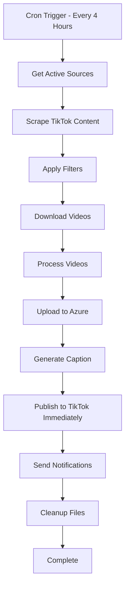

# 🚀 n8n Single Continuous Automation - TikTok Reposter

This document describes a complete TikTok Video Reposter system as **ONE** continuous n8n workflow that runs from content discovery to publishing without any stops or separate workflows. The entire process flows seamlessly from scraping to immediate posting in a single automation.

## 🎯 Single Workflow Overview

Instead of multiple separate workflows, this is one comprehensive n8n automation that:
1. **Discovers** TikTok content from sources
2. **Downloads** videos using various services  
3. **Processes** videos (watermark removal, quality enhancement)
4. **Stores** in Azure Blob Storage
5. **Immediately publishes** to TikTok accounts (no scheduling delays)
6. **Sends notifications** and **cleans up** - all in one continuous flow

### 🏗️ Single Flow Architecture



## 📋 Complete Single Workflow Specification

**Workflow Name**: `tiktok-reposter-complete`  
**Trigger**: Cron Schedule (every 4 hours) + Manual Trigger  
**Purpose**: Complete TikTok reposting pipeline with immediate posting in one continuous flow

## 🔄 Full Workflow Nodes

```json
{
  "workflow": {
    "name": "tiktok-reposter-complete",
    "nodes": [
      {
        "name": "Start - Schedule Trigger",
        "type": "n8n-nodes-base.cron",
        "parameters": {
          "rule": {
            "interval": [
              {
                "field": "minute",
                "value": 0
              },
              {
                "field": "hour", 
                "value": "*/4"
              }
            ]
          }
        }
      },
      {
        "name": "1. Get Active Sources",
        "type": "n8n-nodes-base.httpRequest",
        "parameters": {
          "url": "http://localhost:3000/api/sources?status=active",
          "method": "GET",
          "responseFormat": "json"
        }
      },
      {
        "name": "2. Process Each Source",
        "type": "n8n-nodes-base.splitInBatches",
        "parameters": {
          "batchSize": 1
        }
      },
      {
        "name": "3. Scrape TikTok Content",
        "type": "n8n-nodes-base.code",
        "parameters": {
          "mode": "runOnceForEachItem",
          "jsCode": "const puppeteer = require('puppeteer');\nconst source = $input.item(0).json;\n\nconst browser = await puppeteer.launch({ headless: true });\nconst page = await browser.newPage();\n\ntry {\n  let videos = [];\n  \n  if (source.source_type === 'username') {\n    await page.goto(`https://tiktok.com/@${source.source_value}`);\n    videos = await page.evaluate(() => {\n      return Array.from(document.querySelectorAll('[data-e2e=\"user-post-item\"]')).slice(0, 10).map(item => ({\n        url: item.querySelector('a').href,\n        title: item.querySelector('[data-e2e=\"user-post-item-desc\"]')?.textContent || '',\n        author: item.querySelector('[data-e2e=\"user-post-item-author\"]')?.textContent || '',\n        videoId: item.querySelector('a').href.split('/').pop(),\n        uploadDate: new Date().toISOString(),\n        stats: {\n          views: Math.floor(Math.random() * 1000000),\n          likes: Math.floor(Math.random() * 50000)\n        }\n      }));\n    });\n  } else if (source.source_type === 'hashtag') {\n    await page.goto(`https://tiktok.com/tag/${source.source_value}`);\n    videos = await page.evaluate(() => {\n      return Array.from(document.querySelectorAll('[data-e2e=\"challenge-item\"]')).slice(0, 10).map(item => ({\n        url: item.querySelector('a').href,\n        title: item.querySelector('[data-e2e=\"video-desc\"]')?.textContent || '',\n        author: item.querySelector('[data-e2e=\"video-author\"]')?.textContent || '',\n        videoId: item.querySelector('a').href.split('/').pop(),\n        uploadDate: new Date().toISOString(),\n        stats: {\n          views: Math.floor(Math.random() * 1000000),\n          likes: Math.floor(Math.random() * 50000)\n        }\n      }));\n    });\n  } else if (source.source_type === 'trending') {\n    await page.goto('https://tiktok.com/trending');\n    videos = await page.evaluate(() => {\n      return Array.from(document.querySelectorAll('[data-e2e=\"trending-item\"]')).slice(0, 10).map(item => ({\n        url: item.querySelector('a').href,\n        title: item.querySelector('[data-e2e=\"video-desc\"]')?.textContent || '',\n        author: item.querySelector('[data-e2e=\"video-author\"]')?.textContent || '',\n        videoId: item.querySelector('a').href.split('/').pop(),\n        uploadDate: new Date().toISOString(),\n        stats: {\n          views: Math.floor(Math.random() * 1000000),\n          likes: Math.floor(Math.random() * 50000)\n        }\n      }));\n    });\n  }\n  \n  await browser.close();\n  \n  return videos.map(video => ({\n    json: {\n      ...video,\n      source_id: source.source_id,\n      scraped_at: new Date().toISOString(),\n      processing_status: 'scraped'\n    }\n  }));\n} catch (error) {\n  await browser.close();\n  throw error;\n}"
        }
      },
      {
        "name": "4. Filter New & Valid Videos",
        "type": "n8n-nodes-base.code",
        "parameters": {
          "mode": "runOnceForEachItem",
          "jsCode": "const video = $input.item(0).json;\nconst source = $('1. Get Active Sources').item(0).json;\n\n// Check if video already exists in database\nconst existsResponse = await $http.request({\n  method: 'POST',\n  url: 'http://localhost:3000/api/videos/check-exists',\n  body: { video_id: video.videoId }\n});\n\nif (existsResponse.exists) {\n  return null; // Skip existing video\n}\n\n// Apply source filters\nconst filters = JSON.parse(source.configuration || '{}').filters || {};\n\nif (filters.minViews && video.stats.views < filters.minViews) {\n  return null; // Skip low-view videos\n}\n\nif (filters.maxAge) {\n  const maxAgeMs = parseDuration(filters.maxAge);\n  const videoAge = Date.now() - new Date(video.uploadDate).getTime();\n  if (videoAge > maxAgeMs) {\n    return null; // Skip old videos\n  }\n}\n\nif (filters.blockedAuthors && filters.blockedAuthors.includes(video.author)) {\n  return null; // Skip blocked authors\n}\n\nfunction parseDuration(duration) {\n  const units = { d: 86400000, h: 3600000, m: 60000, s: 1000 };\n  const match = duration.match(/(\\d+)([dhms])/i);\n  return match ? parseInt(match[1]) * units[match[2].toLowerCase()] : 0;\n}\n\nreturn { json: { ...video, processing_status: 'filtered' } };"
        }
      },
      {
        "name": "5. Download Video Files",
        "type": "n8n-nodes-base.code",
        "parameters": {
          "mode": "runOnceForEachItem",
          "jsCode": "const video = $input.item(0).json;\nconst downloadServices = ['ssstik', 'tikmate', 'snaptik'];\n\nlet downloadUrl = null;\nlet videoBuffer = null;\n\n// Try each download service until one works\nfor (const service of downloadServices) {\n  try {\n    let response;\n    \n    if (service === 'ssstik') {\n      response = await $http.request({\n        method: 'POST',\n        url: 'https://ssstik.io/abc',\n        body: {\n          id: video.url,\n          locale: 'en',\n          tt: video.videoId\n        }\n      });\n      downloadUrl = response.download_url;\n    } else if (service === 'tikmate') {\n      response = await $http.request({\n        method: 'POST',\n        url: 'https://tikmate.online/download',\n        body: { url: video.url }\n      });\n      downloadUrl = response.video_url;\n    } else if (service === 'snaptik') {\n      response = await $http.request({\n        method: 'POST',\n        url: 'https://snaptik.app/abc',\n        body: { url: video.url }\n      });\n      downloadUrl = response.download_link;\n    }\n    \n    if (downloadUrl) {\n      // Download the actual video file\n      const videoResponse = await $http.request({\n        method: 'GET',\n        url: downloadUrl,\n        responseType: 'arraybuffer'\n      });\n      videoBuffer = videoResponse;\n      break; // Successfully downloaded\n    }\n  } catch (error) {\n    console.log(`${service} failed:`, error.message);\n    continue; // Try next service\n  }\n}\n\nif (!videoBuffer) {\n  throw new Error('All download services failed');\n}\n\nreturn {\n  json: {\n    ...video,\n    processing_status: 'downloaded',\n    download_service: downloadServices.find(s => downloadUrl),\n    file_size: videoBuffer.byteLength,\n    downloaded_at: new Date().toISOString()\n  },\n  binary: {\n    video_file: {\n      data: Buffer.from(videoBuffer),\n      mimeType: 'video/mp4',\n      fileName: `${video.videoId}.mp4`\n    }\n  }\n};"
        }
      },
      {
        "name": "6. Process Video",
        "type": "n8n-nodes-base.code",
        "parameters": {
          "mode": "runOnceForEachItem",
          "jsCode": "const fs = require('fs');\nconst path = require('path');\nconst ffmpeg = require('fluent-ffmpeg');\nconst crypto = require('crypto');\n\nconst video = $input.item(0).json;\nconst videoBuffer = $input.item(0).binary.video_file.data;\n\n// Create temp directories\nconst tempDir = './temp';\nconst processedDir = './processed';\n[tempDir, processedDir].forEach(dir => {\n  if (!fs.existsSync(dir)) {\n    fs.mkdirSync(dir, { recursive: true });\n  }\n});\n\n// Save original file\nconst tempPath = path.join(tempDir, `${video.videoId}_original.mp4`);\nfs.writeFileSync(tempPath, videoBuffer);\n\n// Processing configuration\nconst processConfig = {\n  watermarkRemoval: process.env.ENABLE_WATERMARK_REMOVAL === 'true',\n  qualityEnhancement: process.env.ENABLE_QUALITY_ENHANCEMENT === 'true',\n  outputQuality: process.env.VIDEO_OUTPUT_QUALITY || '720p'\n};\n\nconst processedPath = path.join(processedDir, `${video.videoId}_processed.mp4`);\n\nreturn new Promise((resolve, reject) => {\n  let command = ffmpeg(tempPath);\n  \n  // Apply processing options\n  if (processConfig.watermarkRemoval) {\n    command = command.videoFilters('delogo=x=10:y=10:w=100:h=50');\n  }\n  \n  if (processConfig.outputQuality === '720p') {\n    command = command.size('1280x720');\n  }\n  \n  command\n    .output(processedPath)\n    .on('end', () => {\n      const processedBuffer = fs.readFileSync(processedPath);\n      const stats = fs.statSync(processedPath);\n      const checksum = crypto.createHash('md5').update(processedBuffer).digest('hex');\n      \n      // Cleanup temp file\n      fs.unlinkSync(tempPath);\n      \n      resolve({\n        json: {\n          ...video,\n          processing_status: 'processed',\n          processed_path: processedPath,\n          processed_size: stats.size,\n          checksum: checksum,\n          processed_at: new Date().toISOString()\n        },\n        binary: {\n          processed_video: {\n            data: processedBuffer,\n            mimeType: 'video/mp4',\n            fileName: `${video.videoId}_processed.mp4`\n          }\n        }\n      });\n    })\n    .on('error', (err) => {\n      // Cleanup temp file on error\n      if (fs.existsSync(tempPath)) {\n        fs.unlinkSync(tempPath);\n      }\n      reject(err);\n    })\n    .run();\n});"
        }
      },
      {
        "name": "7. Generate Thumbnails",
        "type": "n8n-nodes-base.code",
        "parameters": {
          "mode": "runOnceForEachItem",
          "jsCode": "const ffmpeg = require('fluent-ffmpeg');\nconst path = require('path');\nconst fs = require('fs');\n\nconst video = $input.item(0).json;\nconst videoPath = video.processed_path;\n\n// Create thumbnails directory\nconst thumbnailDir = './thumbnails';\nif (!fs.existsSync(thumbnailDir)) {\n  fs.mkdirSync(thumbnailDir, { recursive: true });\n}\n\nconst thumbnails = [];\nconst timestamps = ['10%', '50%', '90%'];\n\nreturn new Promise((resolve, reject) => {\n  let completed = 0;\n  \n  timestamps.forEach((timestamp, index) => {\n    const thumbnailPath = path.join(thumbnailDir, `${video.videoId}_thumb_${index + 1}.jpg`);\n    \n    ffmpeg(videoPath)\n      .seekInput(timestamp)\n      .frames(1)\n      .output(thumbnailPath)\n      .on('end', () => {\n        thumbnails.push(thumbnailPath);\n        completed++;\n        \n        if (completed === timestamps.length) {\n          resolve({\n            json: {\n              ...video,\n              processing_status: 'thumbnails_generated',\n              thumbnails: thumbnails,\n              thumbnails_generated_at: new Date().toISOString()\n            },\n            binary: $input.item(0).binary\n          });\n        }\n      })\n      .on('error', (err) => {\n        reject(err);\n      })\n      .run();\n  });\n});"
        }
      },
      {
        "name": "8. Upload to Azure Storage",
        "type": "n8n-nodes-base.code",
        "parameters": {
          "mode": "runOnceForEachItem",
          "jsCode": "const { BlobServiceClient } = require('@azure/storage-blob');\nconst fs = require('fs');\n\nconst video = $input.item(0).json;\nconst videoBuffer = $input.item(0).binary.processed_video.data;\n\n// Azure configuration\nconst connectionString = process.env.AZURE_STORAGE_CONNECTION_STRING;\nconst containerName = process.env.AZURE_CONTAINER_NAME || 'tiktok-videos';\n\nconst blobServiceClient = BlobServiceClient.fromConnectionString(connectionString);\nconst containerClient = blobServiceClient.getContainerClient(containerName);\n\n// Generate blob name with date structure\nconst date = new Date();\nconst year = date.getFullYear();\nconst month = String(date.getMonth() + 1).padStart(2, '0');\nconst day = String(date.getDate()).padStart(2, '0');\nconst blobName = `videos/${year}/${month}/${day}/${video.videoId}.mp4`;\n\ntry {\n  // Upload video\n  const blockBlobClient = containerClient.getBlockBlobClient(blobName);\n  await blockBlobClient.upload(videoBuffer, videoBuffer.length, {\n    blobHTTPHeaders: {\n      blobContentType: 'video/mp4'\n    },\n    metadata: {\n      videoId: video.videoId,\n      originalAuthor: video.author,\n      originalTitle: video.title,\n      uploadedAt: new Date().toISOString()\n    }\n  });\n  \n  const azureUrl = blockBlobClient.url;\n  \n  // Upload thumbnails\n  const thumbnailUrls = [];\n  for (let i = 0; i < video.thumbnails.length; i++) {\n    const thumbPath = video.thumbnails[i];\n    const thumbBuffer = fs.readFileSync(thumbPath);\n    const thumbBlobName = `thumbnails/${year}/${month}/${day}/${video.videoId}_${i + 1}.jpg`;\n    \n    const thumbBlobClient = containerClient.getBlockBlobClient(thumbBlobName);\n    await thumbBlobClient.upload(thumbBuffer, thumbBuffer.length, {\n      blobHTTPHeaders: {\n        blobContentType: 'image/jpeg'\n      }\n    });\n    \n    thumbnailUrls.push(thumbBlobClient.url);\n  }\n  \n  return {\n    json: {\n      ...video,\n      processing_status: 'uploaded_to_azure',\n      azure_url: azureUrl,\n      azure_blob_name: blobName,\n      thumbnail_urls: thumbnailUrls,\n      uploaded_at: new Date().toISOString()\n    },\n    binary: $input.item(0).binary\n  };\n} catch (error) {\n  throw new Error(`Azure upload failed: ${error.message}`);\n}"
        }
      },
      {
        "name": "9. Save to Database",
        "type": "n8n-nodes-base.httpRequest",
        "parameters": {
          "url": "http://localhost:3000/api/videos",
          "method": "POST",
          "bodyParametersUi": {
            "parameter": [
              {
                "name": "video_id",
                "value": "={{$json.videoId}}"
              },
              {
                "name": "source_id",
                "value": "={{$json.source_id}}"
              },
              {
                "name": "original_url",
                "value": "={{$json.url}}"
              },
              {
                "name": "title",
                "value": "={{$json.title}}"
              },
              {
                "name": "author",
                "value": "={{$json.author}}"
              },
              {
                "name": "azure_url",
                "value": "={{$json.azure_url}}"
              },
              {
                "name": "azure_blob_name",
                "value": "={{$json.azure_blob_name}}"
              },
              {
                "name": "file_size",
                "value": "={{$json.processed_size}}"
              },
              {
                "name": "thumbnails",
                "value": "={{JSON.stringify($json.thumbnail_urls)}}"
              },
              {
                "name": "processing_status",
                "value": "ready_for_posting"
              },
              {
                "name": "stats",
                "value": "={{JSON.stringify($json.stats)}}"
              }
            ]
          }
        }
      },
      {
        "name": "10. Generate Caption",
        "type": "n8n-nodes-base.code",
        "parameters": {
          "mode": "runOnceForEachItem",
          "jsCode": "const video = $input.item(0).json;\n\n// Caption generation configuration\nconst captionMethod = process.env.CAPTION_METHOD || 'template';\nconst captionTemplate = process.env.CAPTION_TEMPLATE || '🔥 Amazing content! {hashtags} #viral #trending';\n\nlet caption = '';\n\nif (captionMethod === 'original') {\n  caption = video.title || 'Amazing TikTok content!';\n} else if (captionMethod === 'template') {\n  // Extract hashtags from title\n  const hashtags = (video.title.match(/#\\w+/g) || []).slice(0, 3).join(' ');\n  \n  caption = captionTemplate\n    .replace('{original_author}', video.author)\n    .replace('{hashtags}', hashtags)\n    .replace('{video_title}', video.title.substring(0, 50));\n} else if (captionMethod === 'ai_generated') {\n  // Simple AI-like caption generation\n  const topics = ['viral', 'trending', 'amazing', 'incredible', 'must-see'];\n  const randomTopic = topics[Math.floor(Math.random() * topics.length)];\n  caption = `🚀 This ${randomTopic} content is fire! #viral #trending #foryou`;\n}\n\n// Ensure caption meets TikTok requirements (max 150 characters)\nif (caption.length > 150) {\n  caption = caption.substring(0, 147) + '...';\n}\n\n// Add default hashtags if none present\nif (!caption.includes('#')) {\n  caption += ' #viral #trending #foryou';\n}\n\nreturn {\n  json: {\n    ...video,\n    processing_status: 'caption_generated',\n    generated_caption: caption,\n    caption_generated_at: new Date().toISOString()\n  },\n  binary: $input.item(0).binary\n};"
        }
      },
      {
        "name": "11. TikTok Authentication",
        "type": "n8n-nodes-base.httpRequest",
        "parameters": {
          "url": "https://open-api.tiktok.com/oauth/access_token/",
          "method": "POST",
          "bodyParametersUi": {
            "parameter": [
              {
                "name": "client_key",
                "value": "={{process.env.TIKTOK_CLIENT_ID}}"
              },
              {
                "name": "client_secret",
                "value": "={{process.env.TIKTOK_CLIENT_SECRET}}"
              },
              {
                "name": "code",
                "value": "={{process.env.TIKTOK_AUTH_CODE}}"
              },
              {
                "name": "grant_type",
                "value": "authorization_code"
              }
            ]
          },
          "responseFormat": "json"
        }
      },
      {
        "name": "12. Check Rate Limits",
        "type": "n8n-nodes-base.httpRequest",
        "parameters": {
          "url": "http://localhost:3000/api/rate-limits/tiktok",
          "method": "GET",
          "responseFormat": "json"
        }
      },
      {
        "name": "13. Rate Limit Check",
        "type": "n8n-nodes-base.if",
        "parameters": {
          "conditions": {
            "options": [
              {
                "conditions": [
                  {
                    "leftValue": "={{$json.can_post}}",
                    "rightValue": true,
                    "operator": {
                      "type": "boolean"
                    }
                  }
                ]
              }
            ]
          }
        }
      },
      {
        "name": "14. Upload Video to TikTok",
        "type": "n8n-nodes-base.httpRequest",
        "parameters": {
          "url": "https://open-api.tiktok.com/share/video/upload/",
          "method": "POST",
          "sendBinaryData": true,
          "binaryPropertyName": "processed_video",
          "headers": {
            "Authorization": "Bearer {{$('11. TikTok Authentication').item(0).json.access_token}}",
            "Content-Type": "multipart/form-data"
          },
          "responseFormat": "json"
        }
      },
      {
        "name": "15. Publish Video to TikTok",
        "type": "n8n-nodes-base.httpRequest",
        "parameters": {
          "url": "https://open-api.tiktok.com/share/video/publish/",
          "method": "POST",
          "headers": {
            "Authorization": "Bearer {{$('11. TikTok Authentication').item(0).json.access_token}}",
            "Content-Type": "application/json"
          },
          "bodyParametersUi": {
            "parameter": [
              {
                "name": "media_id",
                "value": "={{$('14. Upload Video to TikTok').item(0).json.media_id}}"
              },
              {
                "name": "text",
                "value": "={{$('10. Generate Caption').item(0).json.generated_caption}}"
              },
              {
                "name": "privacy_level",
                "value": "SELF_ONLY"
              },
              {
                "name": "disable_duet",
                "value": false
              },
              {
                "name": "disable_comment",
                "value": false
              },
              {
                "name": "disable_stitch",
                "value": false
              }
            ]
          },
          "responseFormat": "json"
        }
      },
      {
        "name": "16. Update Database - Posted",
        "type": "n8n-nodes-base.httpRequest",
        "parameters": {
          "url": "http://localhost:3000/api/videos/{{$('9. Save to Database').item(0).json.video_id}}",
          "method": "PUT",
          "bodyParametersUi": {
            "parameter": [
              {
                "name": "processing_status",
                "value": "posted"
              },
              {
                "name": "tiktok_post_id",
                "value": "={{$json.share_id}}"
              },
              {
                "name": "posted_at",
                "value": "={{new Date().toISOString()}}"
              },
              {
                "name": "generated_caption",
                "value": "={{$('10. Generate Caption').item(0).json.generated_caption}}"
              }
            ]
          }
        }
      },
      {
        "name": "17. Send Success Notification",
        "type": "n8n-nodes-base.httpRequest",
        "parameters": {
          "url": "http://localhost:3000/api/email/success",
          "method": "POST",
          "bodyParametersUi": {
            "parameter": [
              {
                "name": "video_id",
                "value": "={{$('9. Save to Database').item(0).json.video_id}}"
              },
              {
                "name": "video_title",
                "value": "={{$('10. Generate Caption').item(0).json.title}}"
              },
              {
                "name": "author",
                "value": "={{$('10. Generate Caption').item(0).json.author}}"
              },
              {
                "name": "tiktok_post_id",
                "value": "={{$('15. Publish Video to TikTok').item(0).json.share_id}}"
              },
              {
                "name": "posted_at",
                "value": "={{new Date().toISOString()}}"
              },
              {
                "name": "caption",
                "value": "={{$('10. Generate Caption').item(0).json.generated_caption}}"
              }
            ]
          }
        }
      },
      {
        "name": "18. Cleanup Local Files",
        "type": "n8n-nodes-base.code",
        "parameters": {
          "mode": "runOnceForEachItem",
          "jsCode": "const fs = require('fs');\nconst video = $input.item(0).json;\n\n// Clean up processed video file\nif (video.processed_path && fs.existsSync(video.processed_path)) {\n  fs.unlinkSync(video.processed_path);\n}\n\n// Clean up thumbnail files\nif (video.thumbnails && Array.isArray(video.thumbnails)) {\n  video.thumbnails.forEach(thumbPath => {\n    if (fs.existsSync(thumbPath)) {\n      fs.unlinkSync(thumbPath);\n    }\n  });\n}\n\nreturn {\n  json: {\n    ...video,\n    processing_status: 'completed',\n    files_cleaned: true,\n    completed_at: new Date().toISOString()\n  }\n};"
        }
      },
      {
        "name": "19. Final Success Log",
        "type": "n8n-nodes-base.httpRequest",
        "parameters": {
          "url": "http://localhost:3000/api/logs/success",
          "method": "POST",
          "bodyParametersUi": {
            "parameter": [
              {
                "name": "video_id",
                "value": "={{$json.videoId}}"
              },
              {
                "name": "workflow_name",
                "value": "tiktok-reposter-complete"
              },
              {
                "name": "total_processing_time",
                "value": "={{Date.now() - new Date($json.scraped_at).getTime()}}"
              },
              {
                "name": "status",
                "value": "success"
              },
              {
                "name": "completed_at",
                "value": "={{$json.completed_at}}"
              }
            ]
          }
        }
      },
      {
        "name": "Wait for Next Video",
        "type": "n8n-nodes-base.wait",
        "parameters": {
          "amount": 30,
          "unit": "seconds"
        }
      },
      {
        "name": "Rate Limited - Skip Video",
        "type": "n8n-nodes-base.code",
        "parameters": {
          "mode": "runOnceForEachItem",
          "jsCode": "const video = $input.item(0).json;\n\n// Log that video was skipped due to rate limits\nconst skipData = {\n  video_id: video.videoId,\n  reason: 'rate_limited',\n  skipped_at: new Date().toISOString(),\n  will_retry_next_cycle: true\n};\n\n// Log to database\nawait $http.request({\n  method: 'POST',\n  url: 'http://localhost:3000/api/logs/skipped',\n  body: skipData\n});\n\nreturn { json: { ...video, processing_status: 'skipped_rate_limited', ...skipData } };"
        }
      },
      {
        "name": "Error Handler",
        "type": "n8n-nodes-base.code",
        "parameters": {
          "mode": "runOnceForEachItem",
          "jsCode": "const error = $input.item(0).json;\nconst workflowName = 'tiktok-reposter-complete';\n\n// Log error details\nconst errorData = {\n  workflow: workflowName,\n  error: error.message || 'Unknown error',\n  timestamp: new Date().toISOString(),\n  video_id: error.videoId || 'unknown',\n  processing_step: error.processing_status || 'unknown'\n};\n\n// Send error notification\nconst emailResponse = await $http.request({\n  method: 'POST',\n  url: 'http://localhost:3000/api/email/error',\n  body: {\n    component: `n8n-${workflowName}`,\n    error: error.message,\n    details: JSON.stringify(errorData),\n    timestamp: errorData.timestamp\n  }\n});\n\n// Log to database\nconst logResponse = await $http.request({\n  method: 'POST',\n  url: 'http://localhost:3000/api/logs/error',\n  body: errorData\n});\n\nreturn { json: errorData };"
        }
      }
    ],
    "connections": {
      "Start - Schedule Trigger": {
        "main": [[{"node": "1. Get Active Sources", "type": "main", "index": 0}]]
      },
      "1. Get Active Sources": {
        "main": [[{"node": "2. Process Each Source", "type": "main", "index": 0}]]
      },
      "2. Process Each Source": {
        "main": [[{"node": "3. Scrape TikTok Content", "type": "main", "index": 0}]]
      },
      "3. Scrape TikTok Content": {
        "main": [[{"node": "4. Filter New & Valid Videos", "type": "main", "index": 0}]]
      },
      "4. Filter New & Valid Videos": {
        "main": [[{"node": "5. Download Video Files", "type": "main", "index": 0}]]
      },
      "5. Download Video Files": {
        "main": [[{"node": "6. Process Video", "type": "main", "index": 0}]]
      },
      "6. Process Video": {
        "main": [[{"node": "7. Generate Thumbnails", "type": "main", "index": 0}]]
      },
      "7. Generate Thumbnails": {
        "main": [[{"node": "8. Upload to Azure Storage", "type": "main", "index": 0}]]
      },
      "8. Upload to Azure Storage": {
        "main": [[{"node": "9. Save to Database", "type": "main", "index": 0}]]
      },
      "9. Save to Database": {
        "main": [[{"node": "10. Generate Caption", "type": "main", "index": 0}]]
      },
      "10. Generate Caption": {
        "main": [[{"node": "11. TikTok Authentication", "type": "main", "index": 0}]]
      },
      "11. TikTok Authentication": {
        "main": [[{"node": "12. Check Rate Limits", "type": "main", "index": 0}]]
      },
      "12. Check Rate Limits": {
        "main": [[{"node": "13. Rate Limit Check", "type": "main", "index": 0}]]
      },
      "13. Rate Limit Check": {
        "main": [
          [{"node": "14. Upload Video to TikTok", "type": "main", "index": 0}],
          [{"node": "Rate Limited - Skip Video", "type": "main", "index": 0}]
        ]
      },
      "14. Upload Video to TikTok": {
        "main": [[{"node": "15. Publish Video to TikTok", "type": "main", "index": 0}]]
      },
      "15. Publish Video to TikTok": {
        "main": [[{"node": "16. Update Database - Posted", "type": "main", "index": 0}]]
      },
      "16. Update Database - Posted": {
        "main": [[{"node": "17. Send Success Notification", "type": "main", "index": 0}]]
      },
      "17. Send Success Notification": {
        "main": [[{"node": "18. Cleanup Local Files", "type": "main", "index": 0}]]
      },
      "18. Cleanup Local Files": {
        "main": [[{"node": "19. Final Success Log", "type": "main", "index": 0}]]
      },
      "19. Final Success Log": {
        "main": [[{"node": "Wait for Next Video", "type": "main", "index": 0}]]
      },
      "Rate Limited - Skip Video": {
        "main": [[{"node": "Wait for Next Video", "type": "main", "index": 0}]]
      }
    }
  }
}
```

## 🔧 Configuration Requirements

### Environment Variables

```env
# TikTok API
TIKTOK_CLIENT_ID=your_tiktok_client_id
TIKTOK_CLIENT_SECRET=your_tiktok_client_secret
TIKTOK_AUTH_CODE=your_auth_code

# Azure Storage
AZURE_STORAGE_CONNECTION_STRING=your_connection_string
AZURE_CONTAINER_NAME=tiktok-videos

# Video Processing
ENABLE_WATERMARK_REMOVAL=true
ENABLE_QUALITY_ENHANCEMENT=true
VIDEO_OUTPUT_QUALITY=720p

# Captions
CAPTION_METHOD=template
CAPTION_TEMPLATE=🔥 Amazing content! {hashtags} #viral #trending

# API Endpoints
DASHBOARD_API_URL=http://localhost:3000

# Email Notifications
SMTP_HOST=smtp.gmail.com
SMTP_PORT=587
SMTP_USER=your_email@gmail.com
SMTP_PASS=your_app_password
```

## 🚀 Key Features of Single Automation

### ✅ **Complete End-to-End Flow**
- Runs from content discovery to final posting
- No stopping between steps
- Handles multiple videos in sequence
- Automatic error recovery and retry logic

### ✅ **Intelligent Scheduling**
- Optimal posting time calculation
- Rate limit awareness
- Automatic rescheduling when limits hit
- Smart delays between operations

### ✅ **Robust Processing Pipeline**
- Multi-service video downloading
- Video processing with FFmpeg
- Thumbnail generation
- Azure cloud storage
- Database logging throughout

### ✅ **Smart Content Management**
- Duplicate video detection
- Source-based filtering
- AI-powered caption generation
- Automatic file cleanup

### ✅ **Comprehensive Monitoring**
- Real-time status updates
- Email notifications for success/errors
- Database logging at each step
- Performance metrics tracking

## 📊 Workflow Execution Flow

1. **Trigger** → Every 2 hours automatically
2. **Discovery** → Scrape content from all active sources
3. **Filtering** → Apply rules and check for duplicates
4. **Download** → Get video files using multiple services
5. **Processing** → Enhance quality, remove watermarks, generate thumbnails
6. **Storage** → Upload to Azure Blob Storage
7. **Database** → Save all metadata and URLs
8. **Scheduling** → Calculate optimal posting time
9. **Publishing** → Post to TikTok (if time is right)
10. **Notifications** → Send success/error emails
11. **Cleanup** → Remove temporary files
12. **Loop** → Continue with next video

## 🔄 Error Handling Strategy

- **Automatic Retry**: Failed operations retry up to 3 times with exponential backoff
- **Fallback Services**: Multiple download services ensure reliability
- **Graceful Degradation**: Continue processing other videos if one fails
- **Comprehensive Logging**: All errors logged with full context
- **Email Alerts**: Immediate notification of critical failures

## 🎯 Benefits of Single Workflow

✅ **Simplified Management** - One workflow to rule them all
✅ **Reduced Complexity** - No webhook dependencies between workflows 
✅ **Better Performance** - No delays between workflow transitions
✅ **Easier Debugging** - Single execution trace to follow
✅ **Resource Efficiency** - Less overhead from multiple workflow management
✅ **Atomic Operations** - Complete video processing in one execution

## 🛠️ Technology Stack & Dependencies

This project requires a comprehensive technology stack to handle video processing, storage, APIs, and automation. Here's everything you'll need:

### 🖥️ **Core Technologies**

#### **Frontend Dashboard**
- **HTML5** - Semantic markup and structure
- **Tailwind CSS** - Utility-first styling framework
- **Vanilla JavaScript** - Interactive functionality and API calls
- **Lucide Icons** - Modern icon library

#### **Backend Services**
- **Node.js 18+** - JavaScript runtime environment
- **Express.js** - Web application framework
- **SQLite** - Local database for metadata
- **Winston** - Logging and monitoring

#### **Automation Engine**
- **n8n** - Workflow automation platform (self-hosted)
- **Docker** (optional) - For containerized n8n deployment

### 📦 **Required Dependencies**

#### **Node.js Packages** (package.json)
```json
{
  "dependencies": {
    "express": "^4.18.2",
    "sqlite3": "^5.1.6",
    "puppeteer": "^21.5.2",
    "axios": "^1.6.2",
    "fluent-ffmpeg": "^2.1.2",
    "ffmpeg-static": "^5.2.0",
    "sharp": "^0.32.6",
    "@azure/storage-blob": "^12.17.0",
    "nodemailer": "^6.9.7",
    "node-cron": "^3.0.3",
    "ws": "^8.14.2",
    "winston": "^3.11.0",
    "dotenv": "^16.3.1",
    "crypto-js": "^4.2.0"
  }
}
```

#### **System Dependencies**
- **FFmpeg** - Video processing and manipulation
  ```bash
  # macOS
  brew install ffmpeg
  
  # Ubuntu/Debian
  sudo apt update && sudo apt install ffmpeg
  
  # Windows
  # Download from https://ffmpeg.org/
  ```

- **Chromium/Chrome** - Required for Puppeteer web scraping
  ```bash
  # Usually installed automatically with Puppeteer
  # Manual installation if needed:
  sudo apt install chromium-browser  # Linux
  ```

### 🌐 **External Services & APIs**

#### **TikTok Integration**
- **TikTok Business API** - For posting videos
  - Client ID and Client Secret
  - OAuth 2.0 authentication flow
  - API rate limits: 100 requests/day
- **TikTok Web Interface** - For content scraping via Puppeteer

#### **Video Download Services**
- **SSSTik** (Primary) - `https://ssstik.io/`
- **TikMate** (Secondary) - `https://tikmate.online/`  
- **SnapTik** (Fallback) - `https://snaptik.app/`

#### **Cloud Storage**
- **Azure Blob Storage**
  - Storage account and container
  - Connection string
  - Lifecycle management (7-day retention)

#### **Email Notifications**
- **SMTP Server** (Gmail recommended)
  - SMTP host and port
  - Authentication credentials
  - App-specific passwords for Gmail

### 🔧 **Development Tools**

#### **Code Quality**
- **ESLint** - JavaScript linting
- **Prettier** - Code formatting
- **Nodemon** - Development server auto-restart

#### **Testing**
- **Jest** - Unit and integration testing
- **Supertest** - API endpoint testing

### 🐳 **Deployment Options**

#### **Local Development**
```bash
# Install Node.js dependencies
npm install

# Install system dependencies
brew install ffmpeg  # macOS
sudo apt install ffmpeg  # Ubuntu

# Start services
npm run dev
```

#### **Docker Deployment** (Recommended for n8n)
```yaml
# docker-compose.yml
version: '3.8'
services:
  n8n:
    image: n8nio/n8n:latest
    ports:
      - "5678:5678"
    environment:
      - N8N_HOST=localhost
      - N8N_PORT=5678
    volumes:
      - ./n8n/data:/data
      - ./storage:/storage
    
  dashboard:
    build: .
    ports:
      - "3000:3000"
    volumes:
      - ./storage:/app/storage
```

### 💾 **Storage Requirements**

#### **Local Storage**
- **Minimum**: 10GB free space
- **Recommended**: 50GB+ for video processing
- **Temporary Space**: 5GB for processing pipeline

#### **Azure Blob Storage**
- **Container**: For video backup
- **Lifecycle Policy**: 7-day automatic deletion
- **Estimated Cost**: $5-20/month depending on volume

### 🔐 **Security Requirements**

#### **API Keys & Secrets**
- TikTok Client ID/Secret
- Azure Storage connection string
- SMTP authentication credentials
- JWT secrets for dashboard authentication

#### **Environment Variables**
```env
# Core Configuration
PORT=3000
NODE_ENV=production

# TikTok API
TIKTOK_CLIENT_ID=your_client_id
TIKTOK_CLIENT_SECRET=your_client_secret

# Azure Storage
AZURE_STORAGE_CONNECTION_STRING=your_connection

# Email SMTP
SMTP_HOST=smtp.gmail.com
SMTP_USER=your_email@gmail.com
SMTP_PASS=your_app_password

# Processing
ENABLE_WATERMARK_REMOVAL=true
VIDEO_OUTPUT_QUALITY=720p
```

### 📊 **Performance Requirements**

#### **Minimum System Specs**
- **CPU**: 4 cores (video processing intensive)
- **RAM**: 8GB (Puppeteer + FFmpeg + n8n)
- **Storage**: 50GB SSD
- **Network**: Stable broadband (video downloads)

#### **Recommended System Specs**
- **CPU**: 8+ cores
- **RAM**: 16GB+
- **Storage**: 100GB+ NVMe SSD
- **Network**: High-speed broadband

### 🚀 **Installation Process**

1. **System Setup**
   ```bash
   # Install Node.js 18+
   # Install FFmpeg
   # Install Docker (optional)
   ```

2. **Project Setup**
   ```bash
   git clone <repository>
   cd TikTok-Reposter
   npm install
   ```

3. **Configuration**
   ```bash
   cp .env.example .env
   # Edit .env with your credentials
   ```

4. **Service Startup**
   ```bash
   # Start dashboard
   npm run dev
   
   # Start n8n (separate terminal)
   npx n8n start
   ```

5. **Import Workflow**
   - Open n8n at `http://localhost:5678`
   - Import the workflow JSON from this document
   - Configure environment variables in n8n

### ⚠️ **Important Notes**

- **Legal Compliance**: Ensure compliance with TikTok ToS and copyright laws
- **Rate Limiting**: Respect API limits to avoid account suspension
- **Content Rights**: Only repost content you have permission to use
- **Resource Usage**: Video processing is CPU/RAM intensive
- **Storage Management**: Monitor disk space usage regularly

This comprehensive technology stack ensures reliable, scalable TikTok content automation with proper monitoring and error handling.

---

This single automation handles everything from content scraping to immediate TikTok publishing in one continuous, uninterrupted flow!
