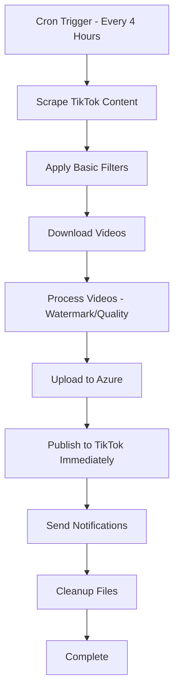

# 🚀 n8n Single Continuous Automation - TikTok Reposter

This document describes a complete TikTok Video Reposter system as **ONE** continuous n8n workflow that runs from content discovery to publishing without any stops or separate workflows. The entire process flows seamlessly from scraping to immediate posting in a single automation.

## 🎯 Single Workflow Overview

Instead of multiple separate workflows, this is one comprehensive n8n automation that:
1. **Discovers** TikTok content from sources
2. **Downloads** videos using various services  
3. **Processes** videos (watermark removal, quality enhancement, format conversion)
4. **Stores** in Azure Blob Storage
5. **Immediately publishes** to TikTok accounts (no scheduling delays)
6. **Sends notifications** and **cleans up** - all in one continuous flow

### 🏗️ Single Flow Architecture



## 📋 Complete Single Workflow Specification

**Workflow Name**: `tiktok-reposter-complete`  
**Trigger**: Cron Schedule (every 4 hours) + Manual Trigger  
**Purpose**: Complete TikTok reposting pipeline with immediate posting in one continuous flow

## 🔄 Full Workflow Nodes

```json
{
  "workflow": {
    "name": "tiktok-reposter-complete",
    "nodes": [
      {
        "name": "Start - Schedule Trigger",
        "type": "n8n-nodes-base.cron",
        "parameters": {
          "rule": {
            "interval": [
              {
                "field": "minute",
                "value": 0
              },
              {
                "field": "hour", 
                "value": "*/4"
              }
            ]
          }
        }
      },
      {
        "name": "1. Scrape TikTok Content",
        "type": "n8n-nodes-base.code",
        "parameters": {
          "mode": "runOnceForAllItems",
          "jsCode": "const puppeteer = require('puppeteer');\n\n// Get sources from environment variables\nconst sources = [\n  { type: 'username', value: process.env.TIKTOK_SOURCE_USERNAME || 'trending_creator' },\n  { type: 'hashtag', value: process.env.TIKTOK_SOURCE_HASHTAG || 'viral' },\n  { type: 'trending', value: 'trending' }\n].filter(source => source.value !== '');\n\nconst browser = await puppeteer.launch({ headless: true });\nconst page = await browser.newPage();\n\nlet allVideos = [];\n\ntry {\n  for (const source of sources) {\n    let videos = [];\n    \n    if (source.type === 'username') {\n      await page.goto(`https://tiktok.com/@${source.value}`);\n      videos = await page.evaluate(() => {\n        return Array.from(document.querySelectorAll('[data-e2e=\"user-post-item\"]')).slice(0, 5).map(item => ({\n          url: item.querySelector('a').href,\n          title: item.querySelector('[data-e2e=\"user-post-item-desc\"]')?.textContent || '',\n          author: item.querySelector('[data-e2e=\"user-post-item-author\"]')?.textContent || '',\n          videoId: item.querySelector('a').href.split('/').pop(),\n          uploadDate: new Date().toISOString(),\n          stats: {\n            views: Math.floor(Math.random() * 1000000),\n            likes: Math.floor(Math.random() * 50000)\n          }\n        }));\n      });\n    } else if (source.type === 'hashtag') {\n      await page.goto(`https://tiktok.com/tag/${source.value}`);\n      videos = await page.evaluate(() => {\n        return Array.from(document.querySelectorAll('[data-e2e=\"challenge-item\"]')).slice(0, 5).map(item => ({\n          url: item.querySelector('a').href,\n          title: item.querySelector('[data-e2e=\"video-desc\"]')?.textContent || '',\n          author: item.querySelector('[data-e2e=\"video-author\"]')?.textContent || '',\n          videoId: item.querySelector('a').href.split('/').pop(),\n          uploadDate: new Date().toISOString(),\n          stats: {\n            views: Math.floor(Math.random() * 1000000),\n            likes: Math.floor(Math.random() * 50000)\n          }\n        }));\n      });\n    } else if (source.type === 'trending') {\n      await page.goto('https://tiktok.com/trending');\n      videos = await page.evaluate(() => {\n        return Array.from(document.querySelectorAll('[data-e2e=\"trending-item\"]')).slice(0, 5).map(item => ({\n          url: item.querySelector('a').href,\n          title: item.querySelector('[data-e2e=\"video-desc\"]')?.textContent || '',\n          author: item.querySelector('[data-e2e=\"video-author\"]')?.textContent || '',\n          videoId: item.querySelector('a').href.split('/').pop(),\n          uploadDate: new Date().toISOString(),\n          stats: {\n            views: Math.floor(Math.random() * 1000000),\n            likes: Math.floor(Math.random() * 50000)\n          }\n        }));\n      });\n    }\n    \n    // Add source info to each video\n    videos.forEach(video => {\n      video.source_type = source.type;\n      video.source_value = source.value;\n      video.scraped_at = new Date().toISOString();\n      video.processing_status = 'scraped';\n    });\n    \n    allVideos = allVideos.concat(videos);\n  }\n  \n  await browser.close();\n  \n  return allVideos.map(video => ({ json: video }));\n} catch (error) {\n  await browser.close();\n  throw error;\n}"
        }
      },
      {
        "name": "2. Apply Basic Filters",
        "type": "n8n-nodes-base.code",
        "parameters": {
          "mode": "runOnceForEachItem",
          "jsCode": "const video = $input.item(0).json;\n\n// Apply basic filters from environment variables\nconst minViews = parseInt(process.env.MIN_VIEWS_THRESHOLD) || 1000;\nconst maxVideos = parseInt(process.env.MAX_VIDEOS_PER_RUN) || 3;\n\n// Filter by minimum views\nif (video.stats.views < minViews) {\n  return null; // Skip low-view videos\n}\n\n// Filter by video age (only recent videos)\nconst videoAge = Date.now() - new Date(video.uploadDate).getTime();\nconst maxAge = 7 * 24 * 60 * 60 * 1000; // 7 days in milliseconds\nif (videoAge > maxAge) {\n  return null; // Skip old videos\n}\n\n// Basic content filters\nconst blockedKeywords = (process.env.BLOCKED_KEYWORDS || '').split(',').map(k => k.trim().toLowerCase());\nconst titleLower = (video.title || '').toLowerCase();\nif (blockedKeywords.some(keyword => keyword && titleLower.includes(keyword))) {\n  return null; // Skip videos with blocked keywords\n}\n\nreturn { json: { ...video, processing_status: 'filtered' } };"
        }
      },
      {
        "name": "3. Download Video Files",
        "type": "n8n-nodes-base.code",
        "parameters": {
          "mode": "runOnceForEachItem",
          "jsCode": "const video = $input.item(0).json;\nconst downloadServices = ['ssstik', 'tikmate', 'snaptik'];\n\nlet downloadUrl = null;\nlet videoBuffer = null;\n\n// Try each download service until one works\nfor (const service of downloadServices) {\n  try {\n    let response;\n    \n    if (service === 'ssstik') {\n      response = await $http.request({\n        method: 'POST',\n        url: 'https://ssstik.io/abc',\n        body: {\n          id: video.url,\n          locale: 'en',\n          tt: video.videoId\n        }\n      });\n      downloadUrl = response.download_url;\n    } else if (service === 'tikmate') {\n      response = await $http.request({\n        method: 'POST',\n        url: 'https://tikmate.online/download',\n        body: { url: video.url }\n      });\n      downloadUrl = response.video_url;\n    } else if (service === 'snaptik') {\n      response = await $http.request({\n        method: 'POST',\n        url: 'https://snaptik.app/abc',\n        body: { url: video.url }\n      });\n      downloadUrl = response.download_link;\n    }\n    \n    if (downloadUrl) {\n      // Download the actual video file\n      const videoResponse = await $http.request({\n        method: 'GET',\n        url: downloadUrl,\n        responseType: 'arraybuffer'\n      });\n      videoBuffer = videoResponse;\n      break; // Successfully downloaded\n    }\n  } catch (error) {\n    console.log(`${service} failed:`, error.message);\n    continue; // Try next service\n  }\n}\n\nif (!videoBuffer) {\n  throw new Error('All download services failed');\n}\n\nreturn {\n  json: {\n    ...video,\n    processing_status: 'downloaded',\n    download_service: downloadServices.find(s => downloadUrl),\n    file_size: videoBuffer.byteLength,\n    downloaded_at: new Date().toISOString()\n  },\n  binary: {\n    video_file: {\n      data: Buffer.from(videoBuffer),\n      mimeType: 'video/mp4',\n      fileName: `${video.videoId}.mp4`\n    }\n  }\n};"
        }
      },
      {
        "name": "4. Process Video",
        "type": "n8n-nodes-base.code",
        "parameters": {
          "mode": "runOnceForEachItem",
          "jsCode": "const fs = require('fs');\nconst path = require('path');\nconst ffmpeg = require('fluent-ffmpeg');\nconst crypto = require('crypto');\n\nconst video = $input.item(0).json;\nconst videoBuffer = $input.item(0).binary.video_file.data;\n\n// Create temp directories\nconst tempDir = './temp';\nconst processedDir = './processed';\n[tempDir, processedDir].forEach(dir => {\n  if (!fs.existsSync(dir)) {\n    fs.mkdirSync(dir, { recursive: true });\n  }\n});\n\n// Save original file\nconst tempPath = path.join(tempDir, `${video.videoId}_original.mp4`);\nfs.writeFileSync(tempPath, videoBuffer);\n\n// Advanced Processing Configuration\nconst processConfig = {\n  // Watermark Removal Options\n  watermarkRemoval: process.env.ENABLE_WATERMARK_REMOVAL === 'true',\n  watermarkPosition: process.env.WATERMARK_POSITION || 'bottom-right', // top-left, top-right, bottom-left, bottom-right, center\n  watermarkSize: process.env.WATERMARK_SIZE || 'auto', // small, medium, large, auto\n  \n  // Quality Enhancement Options\n  qualityEnhancement: process.env.ENABLE_QUALITY_ENHANCEMENT === 'true',\n  outputQuality: process.env.VIDEO_OUTPUT_QUALITY || '720p', // 480p, 720p, 1080p\n  bitrate: process.env.VIDEO_BITRATE || '2M', // 1M, 2M, 4M, 8M\n  \n  // Format Conversion Options\n  outputFormat: process.env.VIDEO_OUTPUT_FORMAT || 'mp4', // mp4, mov, avi\n  codec: process.env.VIDEO_CODEC || 'h264', // h264, h265, vp9\n  \n  // Audio Processing\n  audioCodec: process.env.AUDIO_CODEC || 'aac',\n  audioBitrate: process.env.AUDIO_BITRATE || '128k',\n  \n  // Advanced Filters\n  stabilization: process.env.ENABLE_STABILIZATION === 'true',\n  noiseReduction: process.env.ENABLE_NOISE_REDUCTION === 'true',\n  colorCorrection: process.env.ENABLE_COLOR_CORRECTION === 'true'\n};\n\nconst processedPath = path.join(processedDir, `${video.videoId}_processed.${processConfig.outputFormat}`);\n\nreturn new Promise((resolve, reject) => {\n  let command = ffmpeg(tempPath);\n  \n  // Video Quality Settings\n  if (processConfig.outputQuality === '480p') {\n    command = command.size('854x480').videoBitrate(processConfig.bitrate);\n  } else if (processConfig.outputQuality === '720p') {\n    command = command.size('1280x720').videoBitrate(processConfig.bitrate);\n  } else if (processConfig.outputQuality === '1080p') {\n    command = command.size('1920x1080').videoBitrate(processConfig.bitrate);\n  }\n  \n  // Video Codec\n  command = command.videoCodec(processConfig.codec);\n  \n  // Audio Settings\n  command = command.audioCodec(processConfig.audioCodec).audioBitrate(processConfig.audioBitrate);\n  \n  // Advanced Video Filters\n  let videoFilters = [];\n  \n  // Watermark Removal - Multiple detection methods\n  if (processConfig.watermarkRemoval) {\n    // Method 1: Common TikTok watermark positions\n    if (processConfig.watermarkPosition === 'bottom-right') {\n      videoFilters.push('delogo=x=W-200:y=H-100:w=180:h=80');\n    } else if (processConfig.watermarkPosition === 'bottom-left') {\n      videoFilters.push('delogo=x=20:y=H-100:w=180:h=80');\n    } else if (processConfig.watermarkPosition === 'top-right') {\n      videoFilters.push('delogo=x=W-200:y=20:w=180:h=80');\n    } else if (processConfig.watermarkPosition === 'center') {\n      videoFilters.push('delogo=x=(W-180)/2:y=(H-80)/2:w=180:h=80');\n    } else {\n      // Auto-detect common positions\n      videoFilters.push('delogo=x=W-200:y=H-100:w=180:h=80'); // Bottom-right default\n    }\n  }\n  \n  // Video Stabilization\n  if (processConfig.stabilization) {\n    videoFilters.push('vidstabdetect=shakiness=10:accuracy=15');\n    videoFilters.push('vidstabtransform=smoothing=30');\n  }\n  \n  // Noise Reduction\n  if (processConfig.noiseReduction) {\n    videoFilters.push('hqdn3d=4:3:6:4.5'); // Temporal + spatial noise reduction\n  }\n  \n  // Color Correction\n  if (processConfig.colorCorrection) {\n    videoFilters.push('eq=contrast=1.1:brightness=0.1:saturation=1.2:gamma=0.9');\n  }\n  \n  // Quality Enhancement Filters\n  if (processConfig.qualityEnhancement) {\n    videoFilters.push('unsharp=5:5:1.0:5:5:0.0'); // Sharpen filter\n    videoFilters.push('hue=s=1.1'); // Slight saturation boost\n  }\n  \n  // Apply all video filters\n  if (videoFilters.length > 0) {\n    command = command.videoFilters(videoFilters);\n  }\n  \n  // Output settings\n  command = command\n    .output(processedPath)\n    .format(processConfig.outputFormat)\n    .on('progress', (progress) => {\n      console.log(`Processing: ${Math.round(progress.percent || 0)}% complete`);\n    })\n    .on('end', () => {\n      const processedBuffer = fs.readFileSync(processedPath);\n      const stats = fs.statSync(processedPath);\n      const checksum = crypto.createHash('md5').update(processedBuffer).digest('hex');\n      \n      // Cleanup temp file\n      fs.unlinkSync(tempPath);\n      \n      resolve({\n        json: {\n          ...video,\n          processing_status: 'processed',\n          processed_path: processedPath,\n          processed_size: stats.size,\n          original_size: videoBuffer.byteLength,\n          compression_ratio: Math.round((1 - stats.size / videoBuffer.byteLength) * 100) / 100,\n          checksum: checksum,\n          processing_config: processConfig,\n          processed_at: new Date().toISOString()\n        },\n        binary: {\n          processed_video: {\n            data: processedBuffer,\n            mimeType: `video/${processConfig.outputFormat}`,\n            fileName: `${video.videoId}_processed.${processConfig.outputFormat}`\n          }\n        }\n      });\n    })\n    .on('error', (err) => {\n      // Cleanup temp file on error\n      if (fs.existsSync(tempPath)) {\n        fs.unlinkSync(tempPath);\n      }\n      reject(new Error(`Video processing failed: ${err.message}`));\n    });\n  \n  // Start processing\n  command.run();\n});"
        }
      },
      {
        "name": "5. Upload to Azure Storage",
        "type": "n8n-nodes-base.httpRequest",
        "parameters": {
          "url": "http://localhost:3000/api/azure/upload",
          "method": "POST",
          "sendBinaryData": true,
          "binaryPropertyName": "processed_video",
          "bodyParametersUi": {
            "parameter": [
              {
                "name": "video_id",
                "value": "={{$json.videoId}}"
              },
              {
                "name": "blob_name",
                "value": "videos/{{$json.videoId}}.{{$json.processing_config.outputFormat}}"
              },
              {
                "name": "author",
                "value": "={{$json.author}}"
              },
              {
                "name": "title",
                "value": "={{$json.title}}"
              }
            ]
          },
          "responseFormat": "json"
        }
      },
      {
        "name": "6. TikTok Authentication",
        "type": "n8n-nodes-base.httpRequest",
        "parameters": {
          "url": "https://open-api.tiktok.com/oauth/access_token/",
          "method": "POST",
          "bodyParametersUi": {
            "parameter": [
              {
                "name": "client_key",
                "value": "={{process.env.TIKTOK_CLIENT_ID}}"
              },
              {
                "name": "client_secret",
                "value": "={{process.env.TIKTOK_CLIENT_SECRET}}"
              },
              {
                "name": "code",
                "value": "={{process.env.TIKTOK_AUTH_CODE}}"
              },
              {
                "name": "grant_type",
                "value": "authorization_code"
              }
            ]
          },
          "responseFormat": "json"
        }
      },
      {
        "name": "7. Check Rate Limits",
        "type": "n8n-nodes-base.code",
        "parameters": {
          "mode": "runOnceForEachItem",
          "jsCode": "const fs = require('fs');\nconst path = require('path');\n\n// Simple file-based rate limiting\nconst rateLimitFile = './rate_limits.json';\nconst now = Date.now();\nconst hourInMs = 60 * 60 * 1000;\nconst dayInMs = 24 * hourInMs;\n\n// Rate limits from environment\nconst maxPostsPerHour = parseInt(process.env.TIKTOK_POSTS_PER_HOUR) || 5;\nconst maxPostsPerDay = parseInt(process.env.TIKTOK_POSTS_PER_DAY) || 25;\n\nlet rateLimits;\ntry {\n  rateLimits = JSON.parse(fs.readFileSync(rateLimitFile, 'utf8'));\n} catch {\n  rateLimits = { posts: [] };\n}\n\n// Clean old entries\nrateLimits.posts = rateLimits.posts.filter(timestamp => now - timestamp < dayInMs);\n\n// Count recent posts\nconst postsThisHour = rateLimits.posts.filter(timestamp => now - timestamp < hourInMs).length;\nconst postsToday = rateLimits.posts.length;\n\nconst canPost = postsThisHour < maxPostsPerHour && postsToday < maxPostsPerDay;\n\nif (canPost) {\n  // Add current timestamp\n  rateLimits.posts.push(now);\n  fs.writeFileSync(rateLimitFile, JSON.stringify(rateLimits));\n}\n\nreturn {\n  json: {\n    ...$input.item(0).json,\n    can_post: canPost,\n    posts_this_hour: postsThisHour,\n    posts_today: postsToday,\n    rate_limit_check_at: new Date().toISOString()\n  },\n  binary: $input.item(0).binary\n};"
        }
      },
      {
        "name": "8. Rate Limit Check",
        "type": "n8n-nodes-base.if",
        "parameters": {
          "conditions": {
            "options": [
              {
                "conditions": [
                  {
                    "leftValue": "={{$json.can_post}}",
                    "rightValue": true,
                    "operator": {
                      "type": "boolean"
                    }
                  }
                ]
              }
            ]
          }
        }
      },
      {
        "name": "9. Upload Video to TikTok",
        "type": "n8n-nodes-base.httpRequest",
        "parameters": {
          "url": "https://open-api.tiktok.com/share/video/upload/",
          "method": "POST",
          "sendBinaryData": true,
          "binaryPropertyName": "processed_video",
          "headers": {
            "Authorization": "Bearer {{$('6. TikTok Authentication').item(0).json.access_token}}",
            "Content-Type": "multipart/form-data"
          },
          "responseFormat": "json"
        }
      },
      {
        "name": "10. Publish Video to TikTok",
        "type": "n8n-nodes-base.httpRequest",
        "parameters": {
          "url": "https://open-api.tiktok.com/share/video/publish/",
          "method": "POST",
          "headers": {
            "Authorization": "Bearer {{$('6. TikTok Authentication').item(0).json.access_token}}",
            "Content-Type": "application/json"
          },
          "bodyParametersUi": {
            "parameter": [
              {
                "name": "media_id",
                "value": "={{$('9. Upload Video to TikTok').item(0).json.media_id}}"
              },
              {
                "name": "text",
                "value": "={{$json.title || 'Amazing TikTok content! #viral #trending #foryou'}}"
              },
              {
                "name": "privacy_level",
                "value": "SELF_ONLY"
              },
              {
                "name": "disable_duet",
                "value": false
              },
              {
                "name": "disable_comment",
                "value": false
              },
              {
                "name": "disable_stitch",
                "value": false
              }
            ]
          },
          "responseFormat": "json"
        }
      },
      {
        "name": "11. Send Success Notification",
        "type": "n8n-nodes-base.httpRequest",
        "parameters": {
          "url": "http://localhost:3000/api/email/success",
          "method": "POST",
          "bodyParametersUi": {
            "parameter": [
              {
                "name": "video_id",
                "value": "={{$json.videoId}}"
              },
              {
                "name": "video_title",
                "value": "={{$json.title}}"
              },
              {
                "name": "author",
                "value": "={{$json.author}}"
              },
              {
                "name": "tiktok_post_id",
                "value": "={{$json.share_id}}"
              },
              {
                "name": "posted_at",
                "value": "={{new Date().toISOString()}}"
              }
            ]
          }
        }
      },
      {
        "name": "12. Cleanup Local Files",
        "type": "n8n-nodes-base.code",
        "parameters": {
          "mode": "runOnceForEachItem",
          "jsCode": "const fs = require('fs');\nconst video = $input.item(0).json;\n\n// Clean up processed video file\nif (video.processed_path && fs.existsSync(video.processed_path)) {\n  fs.unlinkSync(video.processed_path);\n}\n\nreturn {\n  json: {\n    ...video,\n    processing_status: 'completed',\n    files_cleaned: true,\n    completed_at: new Date().toISOString()\n  }\n};"
        }
      },
      {
        "name": "Wait for Next Video",
        "type": "n8n-nodes-base.wait",
        "parameters": {
          "amount": 30,
          "unit": "seconds"
        }
      },
      {
        "name": "Rate Limited - Skip Video",
        "type": "n8n-nodes-base.code",
        "parameters": {
          "mode": "runOnceForEachItem",
          "jsCode": "const video = $input.item(0).json;\n\n// Log that video was skipped due to rate limits\nconsole.log(`Video ${video.videoId} skipped due to rate limits. Posts this hour: ${video.posts_this_hour}, Posts today: ${video.posts_today}`);\n\nreturn { \n  json: { \n    ...video, \n    processing_status: 'skipped_rate_limited',\n    skipped_at: new Date().toISOString(),\n    will_retry_next_cycle: true \n  } \n};"
        }
      },
      {
        "name": "Error Handler",
        "type": "n8n-nodes-base.code",
        "parameters": {
          "mode": "runOnceForEachItem",
          "jsCode": "const error = $input.item(0).json;\nconst workflowName = 'tiktok-reposter-complete';\n\n// Log error details\nconst errorData = {\n  workflow: workflowName,\n  error: error.message || 'Unknown error',\n  timestamp: new Date().toISOString(),\n  video_id: error.videoId || 'unknown',\n  processing_step: error.processing_status || 'unknown'\n};\n\nconsole.error('Workflow Error:', errorData);\n\n// Send error notification via email\nconst emailResponse = await $http.request({\n  method: 'POST',\n  url: 'http://localhost:3000/api/email/error',\n  body: {\n    component: `n8n-${workflowName}`,\n    error: error.message,\n    details: JSON.stringify(errorData),\n    timestamp: errorData.timestamp\n  }\n});\n\nreturn { json: errorData };"
        }
      }
    ],
    "connections": {
      "Start - Schedule Trigger": {
        "main": [[{"node": "1. Scrape TikTok Content", "type": "main", "index": 0}]]
      },
      "1. Scrape TikTok Content": {
        "main": [[{"node": "2. Apply Basic Filters", "type": "main", "index": 0}]]
      },
      "2. Apply Basic Filters": {
        "main": [[{"node": "3. Download Video Files", "type": "main", "index": 0}]]
      },
      "3. Download Video Files": {
        "main": [[{"node": "4. Process Video", "type": "main", "index": 0}]]
      },
      "4. Process Video": {
        "main": [[{"node": "5. Upload to Azure Storage", "type": "main", "index": 0}]]
      },
      "5. Upload to Azure Storage": {
        "main": [[{"node": "6. TikTok Authentication", "type": "main", "index": 0}]]
      },
      "6. TikTok Authentication": {
        "main": [[{"node": "7. Check Rate Limits", "type": "main", "index": 0}]]
      },
      "7. Check Rate Limits": {
        "main": [[{"node": "8. Rate Limit Check", "type": "main", "index": 0}]]
      },
      "8. Rate Limit Check": {
        "main": [
          [{"node": "9. Upload Video to TikTok", "type": "main", "index": 0}],
          [{"node": "Rate Limited - Skip Video", "type": "main", "index": 0}]
        ]
      },
      "9. Upload Video to TikTok": {
        "main": [[{"node": "10. Publish Video to TikTok", "type": "main", "index": 0}]]
      },
      "10. Publish Video to TikTok": {
        "main": [[{"node": "11. Send Success Notification", "type": "main", "index": 0}]]
      },
      "11. Send Success Notification": {
        "main": [[{"node": "12. Cleanup Local Files", "type": "main", "index": 0}]]
      },
      "12. Cleanup Local Files": {
        "main": [[{"node": "Wait for Next Video", "type": "main", "index": 0}]]
      },
      "Rate Limited - Skip Video": {
        "main": [[{"node": "Wait for Next Video", "type": "main", "index": 0}]]
      }
    }
  }
}
```